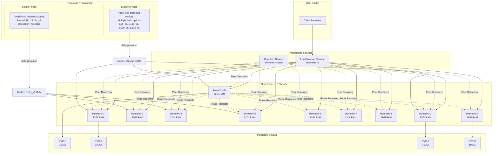

# Biometric Stateful Shards - VM-Style Workload on AKS with Node Auto Provisioning

This example demonstrates how to run a stateful, sharded workload on Azure Kubernetes Service (AKS) with "VM-like" behavior, using AKS Node Auto Provisioning (NAP) powered by Karpenter to find the optimal node SKU.

## Architecture Overview



## What This Example Demonstrates

This tutorial shows how to deploy a **biometric index/shard** workload that has unique requirements:

- **10 fixed shards** that must all be running (system down if any one fails)
- **32Gi memory per shard** with Guaranteed QoS
- **Peer-to-peer routing** between shards (each shard can route requests to others)
- **Stable identity** using StatefulSet with stable DNS names
- **Persistent storage** per shard
- **VM-like behavior**: minimal disruption, controlled updates, no automatic restarts
- **Two-phase deployment**:
  1. **Explore**: Use NAP/Karpenter to try different node SKUs and find optimal packing
  2. **Stable**: Pin workload to chosen SKU with maximum disruption protection

### Why This Matters

Many workloads are migrated from VMs to Kubernetes but need VM-like characteristics:
- Financial services sharding (consistent hashing)
- Biometric/search indexes (each shard holds partition of data)
- Distributed caches (Memcached, Redis Cluster)
- Legacy stateful apps being containerized

This example shows best practices for:
- Using Karpenter/NAP to optimize node SKU selection
- Configuring Guaranteed QoS for memory-intensive workloads
- Preventing unwanted pod evictions and restarts
- Balancing cost (node packing) with reliability (zone spreading)

## Prerequisites

### Required Tools
- `kubectl` (v1.27+)
- `kustomize` (v5.0+) - or use `kubectl apply -k`
- `jq` (for scripts)
- Azure CLI (`az`) - for cluster access
- Access to an AKS cluster with:
  - Node Auto Provisioning enabled (Karpenter)
  - At least 3 availability zones
  - Sufficient quota for E-series VMs

### Enable AKS Node Auto Provisioning

If not already enabled on your cluster:

```bash
# Set variables
export RESOURCE_GROUP_NAME="<your-resource-group>"
export CLUSTER_NAME="<your-cluster-name>"

# Enable Node Auto Provisioning preview feature
az extension add --name aks-preview
az extension update --name aks-preview
az feature register --namespace "Microsoft.ContainerService" --name "NodeAutoProvisioningPreview"

# Wait for registration (check status)
az feature show --namespace "Microsoft.ContainerService" --name "NodeAutoProvisioningPreview"

# Register provider
az provider register --namespace Microsoft.ContainerService

# Update cluster to enable NAP
az aks update \
  --name $CLUSTER_NAME \
  --resource-group $RESOURCE_GROUP_NAME \
  --node-provisioning-mode Auto \
  --network-plugin azure \
  --network-plugin-mode overlay \
  --network-dataplane cilium
```

### Verify Karpenter is Running

```bash
# Check for Karpenter events
kubectl get events -A --field-selector source=karpenter -w

# You should see Karpenter controller running
kubectl get pods -n kube-system | grep karpenter
```

### Get Cluster Credentials

```bash
az aks get-credentials \
  --resource-group $RESOURCE_GROUP_NAME \
  --name $CLUSTER_NAME \
  --overwrite-existing
```

## Quick Start

For an interactive guided experience, use the quickstart script:

```bash
cd examples/biometric-stateful-shards
./scripts/quickstart.sh
```

This script provides a menu-driven interface for all deployment phases and common operations.

For a detailed step-by-step walkthrough, continue reading below.

## Phase 1: Explore - SKU Optimization

In this phase, we deploy the workload with a NodePool that allows multiple instance types. Karpenter will choose the best fit, and we'll observe the packing efficiency.

### Step 1: Deploy Explore Overlay

```bash
# Navigate to example directory
cd examples/biometric-stateful-shards

# Apply explore configuration
kubectl apply -k k8s/overlays/explore

# Watch Karpenter provision nodes
kubectl get events -A --field-selector source=karpenter -w
```

This creates:
- Namespace: `biometric-shards`
- NodePool: `biometric-explore` with multiple E-series SKU options
- AKSNodeClass: `biometric-explore` with Ubuntu 22.04
- StatefulSet: `explore-biometric-shard` with 10 replicas @ 32Gi each
- Services: headless (for peer discovery) and LoadBalancer (for ingress)
- PodDisruptionBudget: `minAvailable: 10` (all must be available)

### Step 2: Monitor Deployment

```bash
# Watch pods come up
kubectl get pods -n biometric-shards -w

# Check StatefulSet status
kubectl get statefulset -n biometric-shards

# See which nodes were created
kubectl get nodes -l workload=biometric-explore
```

### Step 3: Run Verification Script

```bash
# Verify all components are healthy
./scripts/verify.sh
```

Expected output:
- ✓ Namespace exists
- ✓ StatefulSet with 10/10 ready replicas
- ✓ All pods in Running state
- ✓ DNS resolution works for headless service
- ✓ Individual pod DNS resolution works (biometric-shard-0.biometric-shards.svc.cluster.local)
- ✓ PVCs created and bound
- ✓ All pods have Guaranteed QoS (requests == limits)

### Step 4: Test Routing

```bash
# Test shard routing behavior
./scripts/route-test.sh
```

This verifies:
- LoadBalancer is accessible
- Each shard is reachable via headless service
- Routing is consistent (same key always goes to same shard)

### Step 5: Analyze Packing Efficiency

```bash
# Run packing analysis
./scripts/packing-summary.sh
```

This script shows:
- How many pods are on each node
- Instance types selected by Karpenter
- Memory utilization per node
- Recommendations for optimal SKU

**Example output:**
```
Node: aks-biometric-explore-vmss000000
  Instance Type: Standard_E16s_v5
  Allocatable Memory: 119.2Gi
  Biometric Pods: 3
  Requested Memory: 96Gi
  Memory Utilization: 80.5%

SKU Recommendations:
  • 3x Standard_E16s_v5  (128Gi each) = ~3.3 pods/node ✓ RECOMMENDED
  • 4x Standard_E8s_v5   (64Gi each)  = ~2.5 pods/node
  • 2x Standard_E20s_v5  (160Gi each) = 5 pods/node
```

### Step 6: Observe Costs with aks-node-viewer

AKS Node Viewer is a tool to visualize node utilization and costs in real-time.

```bash
# Install aks-node-viewer (if not already installed)
# Download from: https://github.com/Azure/aks-node-viewer/releases
wget https://github.com/Azure/aks-node-viewer/releases/latest/download/aks-node-viewer_linux_amd64.tar.gz
tar -xzf aks-node-viewer_linux_amd64.tar.gz
sudo mv aks-node-viewer /usr/local/bin/
rm aks-node-viewer_linux_amd64.tar.gz

# Run aks-node-viewer (requires cluster credentials)
aks-node-viewer

# Alternative: use specific resource group and cluster
aks-node-viewer --resources $RESOURCE_GROUP_NAME --cluster-name $CLUSTER_NAME
```

AKS Node Viewer shows:
- Real-time node CPU/memory utilization
- Pod placement across nodes
- **Estimated hourly cost per node**
- **Total cluster cost**
- Node auto-scaling events

**Key metrics to observe:**
- Cost per shard: Total cost / 10 shards
- Memory utilization: Should be 60-80% for good packing
- CPU utilization: Varies based on workload
- Cost comparison: Compare different SKU choices

**Example visualization in aks-node-viewer:**
```
NODE                              CPU  MEM   PODS  COST/HR
aks-biometric-explore-vmss000000  15%  80%   3/30  $0.672
aks-biometric-explore-vmss000001  12%  75%   3/30  $0.672
aks-biometric-explore-vmss000002  18%  82%   4/30  $0.672
───────────────────────────────────────────────────────────
TOTAL                             45%  79%   10    $2.016/hr
ESTIMATED MONTHLY                                  ~$1,451
```

**Cost optimization tips:**
1. Fewer, larger nodes = lower networking overhead but less HA
2. More, smaller nodes = better HA but higher cost per GB
3. Aim for 70-85% memory utilization for balance
4. Consider reserved instances for stable production workloads (up to 72% savings)

**To compare different SKU costs manually:**
```bash
# List current node costs
kubectl get nodes -o json | jq -r '
  .items[] | 
  select(.metadata.labels.workload == "biometric-explore") |
  "\(.metadata.name)\t\(.metadata.labels["node.kubernetes.io/instance-type"])"
' | while read node sku; do
  echo "Node: $node, SKU: $sku"
  # Check Azure pricing: https://azure.microsoft.com/en-us/pricing/details/virtual-machines/linux/
done

# Calculate cost per shard
echo "Total hourly cost / 10 shards = cost per shard"
```

### Step 7: Choose Your SKU

Based on the packing analysis and cost observations:

1. **Best cost efficiency**: Fewer nodes with higher memory (e.g., 2x E20s_v5)
2. **Best HA/resilience**: More nodes across zones (e.g., 3x E16s_v5)
3. **Balanced**: 3x E16s_v5 (recommended for most production use cases)

Update `k8s/overlays/stable/nodepool.yaml` with your chosen SKU.

## Phase 2: Stable - Production Deployment

Once you've chosen the optimal SKU, deploy the stable configuration which pins the workload to that SKU and adds maximum disruption protection.

### Step 1: Update Stable NodePool

Edit `k8s/overlays/stable/nodepool.yaml`:

```yaml
# Line 48-51: Set your chosen instance type
- key: node.kubernetes.io/instance-type
  operator: In
  values:
  - Standard_E16s_v5  # ← Update this based on your exploration
```

### Step 2: Delete Explore Deployment

```bash
# Delete explore resources
kubectl delete -k k8s/overlays/explore

# Wait for pods to terminate gracefully (up to 5 minutes due to terminationGracePeriodSeconds)
kubectl get pods -n biometric-shards -w

# Note: PVCs are retained! They'll be reused by stable deployment
```

### Step 3: Deploy Stable Overlay

```bash
# Apply stable configuration
kubectl apply -k k8s/overlays/stable

# Watch nodes being provisioned with new stable NodePool
kubectl get nodes -l workload=biometric-stable -w

# Watch pods schedule onto stable nodes
kubectl get pods -n biometric-shards -w
```

The stable deployment differs from explore:
- **NodePool `consolidationPolicy`**: `WhenEmpty` only (no automatic consolidation)
- **Node taints**: `biometric=reserved:NoSchedule` (dedicated nodes)
- **Pod affinity**: **Required** (not preferred) - must schedule on stable nodes
- **Karpenter annotation**: `karpenter.sh/do-not-disrupt: "true"` on pods
- **PDB**: Still `minAvailable: 10`

### Step 4: Verify Stable Deployment

```bash
# Run verification
./scripts/verify.sh

# Verify node taints and labels
kubectl get nodes -l workload=biometric-stable -o json | \
  jq -r '.items[] | "\(.metadata.name)\t\(.spec.taints)\t\(.metadata.labels.workload)"'

# Verify pods are scheduled only on stable nodes
kubectl get pods -n biometric-shards -o wide
```

### Step 5: Test Disruption Protection

```bash
# Try to drain a node (should be blocked by PDB)
NODE_NAME=$(kubectl get nodes -l workload=biometric-stable -o jsonpath='{.items[0].metadata.name}')
kubectl drain $NODE_NAME --ignore-daemonsets --delete-emptydir-data

# Expected output:
# error when evicting pods/... Cannot evict pod as it would violate the pod's disruption budget

# Verify Karpenter won't consolidate (check logs)
kubectl logs -n kube-system -l app.kubernetes.io/name=karpenter -f
```

## Operations

### Upgrading the Application

With `updateStrategy: OnDelete`, upgrades are manual and controlled:

```bash
# Update the StatefulSet (e.g., new image version)
kubectl set image statefulset/stable-biometric-shard \
  -n biometric-shards \
  biometric-app=<new-image>:tag

# Nothing happens automatically due to OnDelete strategy

# Manually delete pods one at a time to upgrade
for i in {9..0}; do
  echo "Upgrading shard $i..."
  kubectl delete pod stable-biometric-shard-$i -n biometric-shards
  
  # Wait for pod to be ready before moving to next
  kubectl wait --for=condition=ready \
    pod/stable-biometric-shard-$i \
    -n biometric-shards \
    --timeout=600s
  
  echo "Shard $i upgraded and ready"
  sleep 30  # Optional: wait between upgrades
done
```

**Why OnDelete?**
- Prevents accidental rollouts during cluster upgrades
- Gives you control over exactly when each shard restarts
- Allows testing one shard before rolling to others
- VM-like: you decide when to restart, not Kubernetes

### Handling Node Maintenance

**Problem**: PDB blocks node drains because all 10 pods must be available.

**Solutions**:

**Option 1: Temporarily relax PDB**
```bash
# Reduce PDB to allow 1 pod to be down
kubectl patch pdb stable-biometric-shard-pdb -n biometric-shards \
  --type merge -p '{"spec":{"minAvailable":9}}'

# Drain node
kubectl drain $NODE_NAME --ignore-daemonsets --delete-emptydir-data

# Restore PDB
kubectl patch pdb stable-biometric-shard-pdb -n biometric-shards \
  --type merge -p '{"spec":{"minAvailable":10}}'
```

**Option 2: Scale up temporarily**
```bash
# Add an extra shard temporarily
kubectl scale statefulset stable-biometric-shard -n biometric-shards --replicas=11

# Wait for new shard to be ready
kubectl wait --for=condition=ready pod/stable-biometric-shard-10 \
  -n biometric-shards --timeout=600s

# Now you can drain (10 will be available while 1 is evicted)
kubectl drain $NODE_NAME --ignore-daemonsets --delete-emptydir-data

# Scale back down
kubectl scale statefulset stable-biometric-shard -n biometric-shards --replicas=10
```

**Option 3: Accept downtime window**
```bash
# Delete PDB temporarily
kubectl delete pdb stable-biometric-shard-pdb -n biometric-shards

# Drain node (system will be briefly down as pods move)
kubectl drain $NODE_NAME --ignore-daemonsets --delete-emptydir-data

# Recreate PDB
kubectl apply -k k8s/overlays/stable
```

### Detecting System Down

Since the system is down if ANY shard is down, monitoring is critical:

```bash
# Check if all shards are ready
READY=$(kubectl get statefulset stable-biometric-shard -n biometric-shards \
  -o jsonpath='{.status.readyReplicas}')

if [ "$READY" -ne 10 ]; then
  echo "ALERT: System is DOWN - only $READY/10 shards ready"
  exit 1
fi
```

**Prometheus AlertRule:**
```yaml
- alert: BiometricSystemDown
  expr: |
    kube_statefulset_status_replicas_ready{statefulset="stable-biometric-shard",namespace="biometric-shards"} < 10
  for: 1m
  labels:
    severity: critical
  annotations:
    summary: "Biometric system is down"
    description: "Only {{ $value }}/10 shards are ready. System is unavailable."
```

### Storage Management

```bash
# List all PVCs
kubectl get pvc -n biometric-shards

# PVCs are NOT deleted when StatefulSet is deleted
# To manually clean up:
kubectl delete pvc -l app=biometric-shard -n biometric-shards

# Check PV reclaim policy
kubectl get pv | grep biometric-shards
```

### Monitoring Key Metrics

```bash
# Pod resource usage
kubectl top pods -n biometric-shards

# Node resource usage
kubectl top nodes -l workload=biometric-stable

# Karpenter metrics (if Prometheus is enabled)
kubectl get --raw /metrics | grep karpenter
```

## Cost Monitoring and Optimization

### Continuous Cost Monitoring

```bash
# Run aks-node-viewer in watch mode
aks-node-viewer --resources $RESOURCE_GROUP_NAME --cluster-name $CLUSTER_NAME

# Or use Azure Cost Management
az consumption usage list \
  --start-date 2024-01-01 \
  --end-date 2024-01-31 \
  --query "[?contains(instanceId, 'biometric-stable')]" \
  -o table
```

### Cost Optimization Checklist

- [ ] Right-size node SKU based on packing-summary.sh
- [ ] Use Azure Reserved Instances for stable nodepool (up to 72% savings)
- [ ] Set appropriate `limits.memory` on NodePool to prevent over-provisioning
- [ ] Monitor actual CPU usage and reduce CPU requests if over-provisioned
- [ ] Use Azure Spot VMs for development/testing environments (not production)
- [ ] Enable Azure Hybrid Benefit if you have Windows Server licenses
- [ ] Review storage class (Premium SSD vs Standard SSD) based on IOPS needs
- [ ] Use Azure Monitor Container Insights to track costs over time

### Reserved Instance Sizing

Based on stable phase (3x Standard_E16s_v5 recommended):
```
3 VMs × $0.672/hour × 730 hours/month = $1,471.68/month (Pay-as-you-go)
3 VMs × $0.188/hour × 730 hours/month = $410.76/month (3-year reserved, ~72% savings)
```

Purchase reserved instances through Azure Portal > Reservations.

## Workflow Summary

```mermaid
graph LR
    A[Start: Need to run<br/>10 shards @ 32Gi each] --> B[Phase 1: Explore]
    B --> C[Deploy with<br/>biometric-explore<br/>NodePool]
    C --> D[Karpenter chooses<br/>SKUs automatically]
    D --> E[Run verify.sh<br/>and route-test.sh]
    E --> F[Run packing-summary.sh<br/>Observe with aks-node-viewer]
    F --> G{Good packing<br/>efficiency?}
    G -->|No| H[Adjust NodePool<br/>instance type list]
    H --> C
    G -->|Yes| I[Note optimal SKU<br/>and cost]
    I --> J[Phase 2: Stable]
    J --> K[Update stable NodePool<br/>with chosen SKU]
    K --> L[Delete explore<br/>deployment]
    L --> M[Deploy stable<br/>configuration]
    M --> N[Verify disruption<br/>protection]
    N --> O[Production Ready!<br/>Monitor costs]
    
    style A fill:#e1f5ff
    style B fill:#fff4e1
    style J fill:#e1ffe1
    style O fill:#d4edda
```



**Key Transitions:**
- **Explore → Observe**: Karpenter auto-provisions, you observe
- **Observe → Decide**: Use scripts + aks-node-viewer to analyze packing/cost
- **Decide → Stable**: Pin to chosen SKU with max protection
- **Stable → Production**: System is disruption-resistant, cost-optimized

## Cleanup

```bash
# Delete stable deployment
kubectl delete -k k8s/overlays/stable

# Delete PVCs (if you want to remove data)
kubectl delete pvc -l app=biometric-shard -n biometric-shards

# Delete namespace
kubectl delete namespace biometric-shards

# Karpenter will automatically deprovision nodes when they're empty
```

## Troubleshooting

### Pods stuck in Pending

```bash
# Check Karpenter logs
kubectl logs -n kube-system -l app.kubernetes.io/name=karpenter --tail=100

# Check for provisioning events
kubectl get events -A --field-selector source=karpenter --sort-by='.lastTimestamp'

# Check node requirements can be satisfied
kubectl describe pod <pod-name> -n biometric-shards
```

Common issues:
- Insufficient quota for requested instance types
- Instance type not available in chosen zones
- Node requirements too restrictive

### PDB blocking operations

```bash
# Check PDB status
kubectl get pdb -n biometric-shards
kubectl describe pdb stable-biometric-shard-pdb -n biometric-shards

# See which pods are disrupting
kubectl get pods -n biometric-shards -o json | \
  jq -r '.items[] | select(.status.phase!="Running") | .metadata.name'
```

### DNS resolution fails

```bash
# Check CoreDNS
kubectl get pods -n kube-system -l k8s-app=kube-dns

# Test DNS from a pod
kubectl exec -it <pod-name> -n biometric-shards -- nslookup biometric-shards.biometric-shards.svc.cluster.local

# Check service endpoints
kubectl get endpoints -n biometric-shards
```

## Additional Resources

- [AKS Node Auto Provisioning Documentation](https://learn.microsoft.com/en-us/azure/aks/node-autoprovision)
- [Karpenter Documentation](https://karpenter.sh/)
- [StatefulSet Concepts](https://kubernetes.io/docs/concepts/workloads/controllers/statefulset/)
- [Pod Disruption Budgets](https://kubernetes.io/docs/tasks/run-application/configure-pdb/)
- [Guaranteed QoS](https://kubernetes.io/docs/tasks/configure-pod-container/quality-service-pod/)
- [AKS Node Viewer](https://github.com/Azure/aks-node-viewer)
- [Azure VM Pricing](https://azure.microsoft.com/en-us/pricing/details/virtual-machines/linux/)
- [Azure Reserved VM Instances](https://azure.microsoft.com/en-us/pricing/reserved-vm-instances/)

## License

This example is part of the aks-the-good-stuff repository. See repository root for license information.
