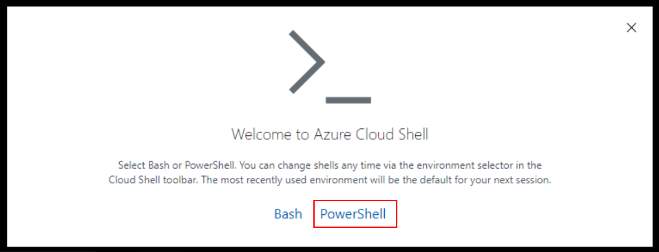
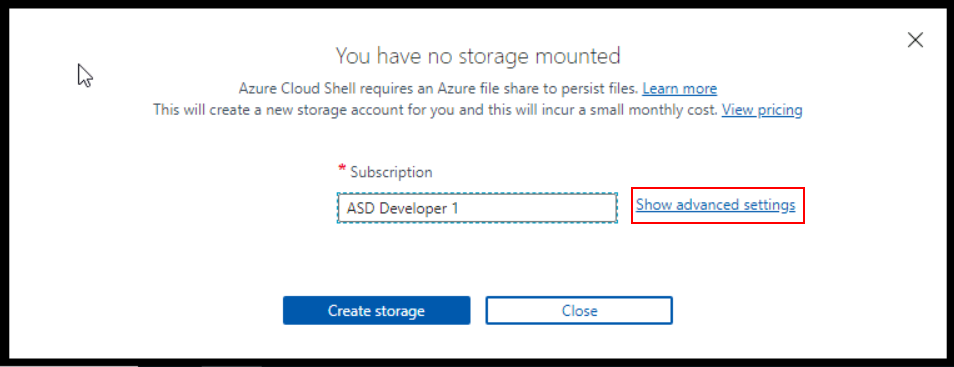
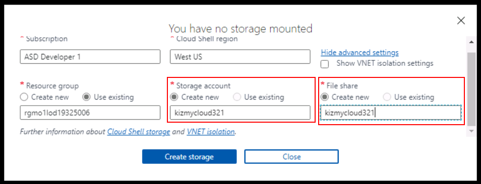
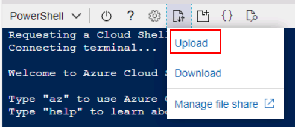

# Kubernetes Tech Brief Labs with CloudShell

1. Open the Azure Portal and login with your student account.
   
2. Click the **CloudShell** icon on the top bar.


3. Click the **PowerShell** option.




4. Click the **Show Advanced Settings** link.




5. Since this subscription is shared between many people, you'll need to enter a unique name for the storage account and the file share.  Use your initials in the name to help ensure uniqueness.




6. When the account is created, upload the **K8s-labs.zip** file.




7. Unzip the uploaded file.  The module folders will be automatically created.

```Powershell
unzip K8s-labs.zip
```

