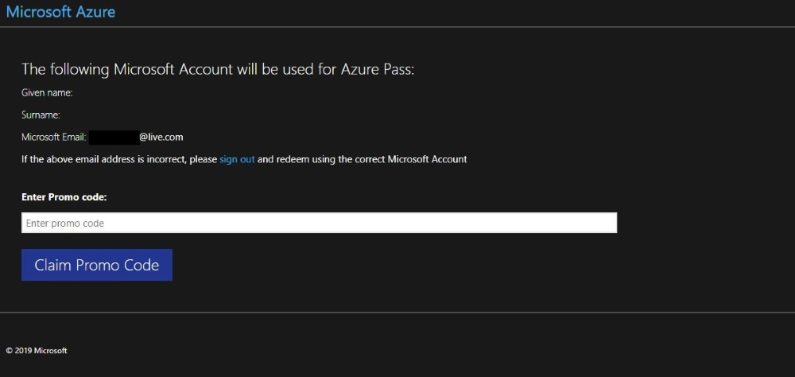
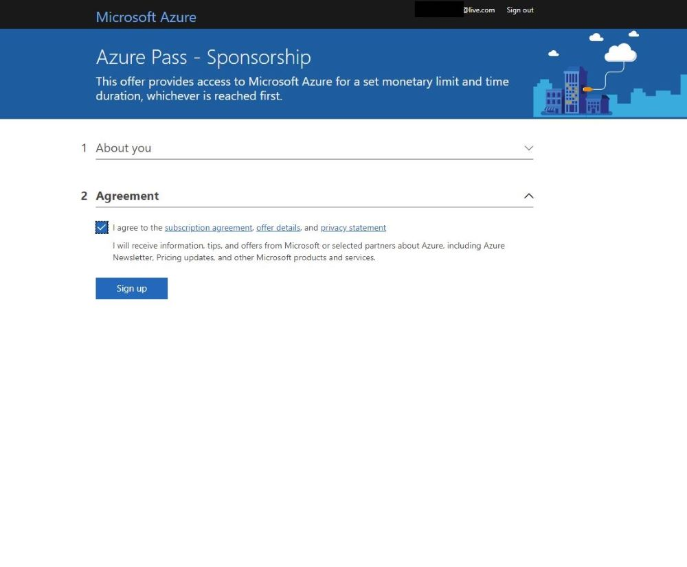
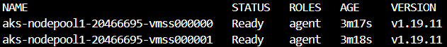
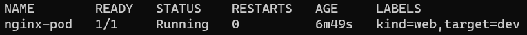
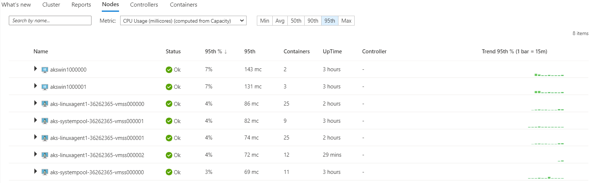

# Modules List

[Create a Microsoft Azure Pass Subscription](#create-a-microsoft-azure-pass-subscription)

[Lab Module 1: Core Kubernetes Concepts](#lab-module-1-core-kubernetes-concepts) 

[Lab Module 2: Azure Kubernetes Service](#lab-module-2-azure-kubernetes-service)

[Lab Module 3: Intermediate Kubernetes Concepts](#lab-module-3-intermediate-kubernetes-concepts)

[Lab Module 4: Application Deployment to Kubernetes](#lab-module-4-application-development-with-kubernetes)

[Lab Module 5: Advanced Kubernetes Topics - Part 1](#lab-module-6-advanced-kubernetes-topics---part-1)


===
# Create a Microsoft Azure Pass Subscription

### Creating an Azure Pass subscription is a two step process.

1. Redeem your Azure Pass Promo Code
2. Activate your subscription

### Step 1: Redeeming a Microsoft Azure Pass Promo Code:

In the lab VM, open a browser and navigate to: www.microsoftazurepass.com

> It is recommended you close all browsers and open a new In-Private Browser session. Other log-ins can persist and cause errors during the activation step.


Click the start button to get started.


Enter your account login information and select “Sign In”.


Click “Confirm” if the correct email address is listed.


Select the **Resources** tab on the Instructions Panel


Place the cursor in the **Enter Promo Code** text box.  Click the **T** button by the *Azure Promo Code*. 



After you enter your promo code click “Claim Promo Code”. 


It may take up to 5 minutes to process the redemption.


### Step 2: Activate your subscription:

When the redemption process is completed, it will redirect to the sign up page.

Enter your account information and click “Next”.


Click the agreement check box and click the Sign up button.

It may take a few minutes to process the request.



Your Azure subscription is ready!


You can check the balance of your Azure Pass Credits on:

```Powershell
https://www.microsoftazuresponsorships.com/balance
```


[List of Modules](#modules-list)
===
# Lab Module 1: Core Kubernetes Concepts


> Estimated Duration: 60 minutes

## Module 1 Table of Contents

[Exercise: Create a Basic Azure Kubernetes Service (AKS) Cluster](#exercise-create-a-basic-azure-kubernetes-service-aks-cluster)

[Exercise: Creating a Pod Declaratively](#exercise-creating-a-pod-declaratively)

[Exercise: Adding/Updating/Deleting Labels on a Pod](#exercise-addingupdatingdeleting-labels-on-a-pod)

[Exercise: Working with Deployments](#exercise-working-with-deployments)

[Exercise: Working with Services](#exercise-working-with-services)

[Exercise: Cleanup](#exercise-cleanup)

# Exercise: Create a Basic Azure Kubernetes Service (AKS) Cluster

In this exercise you will create a simple AKS cluster. In the next module, you'll create a more complete one.

### Task 1 - Login into your subscription and register providers

1. Open a Windows Terminal window (defaults to PowerShell).


> Windows Terminal allows you to open tabbed command terminals.

2. Login to Azure.

```
az login
```

3. Set the current subscription.

```
az account set --subscription "Azure Pass - Sponsorship"
```

4. Register needed providers.

```
az provider register --namespace Microsoft.Storage
az provider register --namespace Microsoft.Compute
az provider register --namespace Microsoft.Network
az provider register --namespace Microsoft.Monitor
az provider register --namespace Microsoft.Insights
az provider register --namespace Microsoft.ManagedIdentity
az provider register --namespace Microsoft.OperationalInsights
az provider register --namespace Microsoft.OperationsManagement
az provider register --namespace Microsoft.KeyVault
az provider register --namespace Microsoft.ContainerRegistry
az provider register --namespace Microsoft.ContainerService
az provider register --namespace Microsoft.Kubernetes
```

5. Open a browser and navigate to the Azure Portal: **_portal.azure.com_**

6. Search for and open the **Subscriptions** blade. Select your **Azure Pass - Sponsorship** subscription.

7. Scroll down and select **Resource providers**.


8. Watch the progress of the registration process until all the providers listed above have been registered. Click the _Refresh_ button every few minutes to update the progess. Once everything has been registered, continue with the tasks in this lab.

### Task 2 - Define variables and create resource group

[!Alert] Get region information from the instructor!!

1. Select the region closest to your location.  Ask your instructor for region options: @lab.textbox(region)

2. Set your initials.

```PowerShell
$YOUR_INITIALS="<your initials>"
```

<details>
<summary>Linux</summary>

```sh
YOUR_INITIALS="<your initials>"
```

</details> 

3. Define global variables

```PowerShell
$INITIALS="$($YOUR_INITIALS)".ToLower()
$RESOURCE_GROUP="azure-$($INITIALS)-rg"
$LOCATION="@lab.Variable(region)"
```

<details>
<summary>Linux</summary>

```sh
INITIALS=$(echo "$YOUR_INITIALS" | tr '[:upper:]' '[:lower:]')
RESOURCE_GROUP="azure-${INITIALS}-rg"
export LOCATION=$(lab.Variable region)
echo "Initials: $INITIALS"
echo "Resource Group: $RESOURCE_GROUP"
echo "Location: $LOCATION"
```
</details> 

4. Get list of available VM sizes with 2 cores in your region.

```
az vm list-sizes --location $LOCATION --query "[?numberOfCores == ``2``].{Name:name}" -o table
```

5. Set the VM SKU to one of the available values or use the default below.

```PowerShell
$VM_SKU="Standard_D2as_v5"
```

<details>
<summary>Linux</summary>

```sh
export VM_SKU="Standard_D2as_v5"
```

</details>


### Task 3 - Create resource group and a basic cluster using Azure CLI

1. Create Resource Group.

```
az group create --location $LOCATION `
                --resource-group $RESOURCE_GROUP
```

2. Define variables for AKS cluster.

```PowerShell
$AKS_NAME="aks-$($INITIALS)"
Write-Host "AKS Cluster Name: $AKS_NAME"
```

<details>
<summary>Linux</summary>

```sh
AKS_NAME="aks-$INITIALS"
echo "AKS Cluster Name: $AKS_NAME"
```

</details>

3. Create a simple AKS cluster.

```
az aks create --node-count 2 --generate-ssh-keys --node-vm-size $VM_SKU --name $AKS_NAME   --resource-group $RESOURCE_GROUP
```

> The creation process will take able 5-10 minutes.

4. Once complete, connect the cluster to your local client machine.

```
az aks get-credentials --name $AKS_NAME --resource-group $RESOURCE_GROUP
```

5. Confirm the connection to the cluster.

```
kubectl get nodes
```

This should return a list of nodes similar to the one below:



[Module 1 Table of Contents](#module-1-table-of-contents)

[List of Modules](#modules-list)

# Exercise: Creating a Pod Declaratively

This Exercise demonstrates the use of a YAML file to create a pod declaratively.

### Task 1 - Create a Pod declaratively

1. Change into the **Module1** folder

```PowerShell
cd C:\k8s\labs\Module1
```

<details>
<summary>Linux</summary>

```sh
cd ~/k8s/labs/Module1
```

</details>


2. Use the YAML file provided to create a Pod. You may want to open the **simple-pod.yaml** file and review its contents.

The pod definition contains the **Nginx** container that listens to port 80.

```
kubectl apply -f simple-pod.yaml
```

3. Now, make sure pod is up and running.

```
kubectl get pods
```

You should see a pod named **nginx-pod**


4. Add a second pod, then check the list again.

```
kubectl apply -f simple-pod2.yaml
kubectl get pods
```

### Task 2 - Filter pods based on a label

1. Show all the labels in the pods

```
kubectl get pods --show-labels
```



2. Let's say you want to list pods that have a label named **kind=web** associated with them. You can use **-l** switch to apply filter based on labels.

```
kubectl get pod -l kind=web
```

3. To prove that this works as expected, run the command again but change the value of label **kind** to **db**. Notice, this time _kubectl_ doesn't return any pods because there are no pods that match the label **kind** and a value of **db**.

```
kubectl get pod -l kind=db
```

### Task 3 - View complete definition of the Pod

1. Query Kubernetes to return the complete definition of a Pod from its internal database by exporting the output (**-o**) to **YAML**. Then pipe the result to a file.

```
kubectl get pods nginx-pod -o yaml > mypod.yaml
```

> To view the JSON version, use the **-o json** flag instead.

2.  View the contents of the generated file in VS Code (or an editor of your choice).

```
code mypod.yaml
```


**NOTE:** Observe all the properties that Kubernetes populated with default values when it saved the Pod definition to its database.

[Module 1 Table of Contents](#module-1-table-of-contents)

[List of Modules](#modules-list)

# Exercise: Adding/Updating/Deleting Labels on a Pod

In this Exercise, you will create a pod that has labels associated with it. Labels make it easy to filter the pods later. Labels play a vital role in the Kubernetes ecosystem, so it's important to understand their proper usage.

### Task 1 - Assign a new label to a running Pod

1. Assign a new label (key=value) pair to a running pod. This comes in handy when you are troubleshooting an issue and would like to distinguish between different pod(s). Assign a new label **health=fair** to the pod **nginx-pod**, which is already running.

```
kubectl label pod nginx-pod health=fair
```

2. Run the command below to show the pod labels. Notice that now an additional label is shown with the pod.

```
kubectl get pods nginx-pod --show-labels
```

### Task 2 - Update an existing label that is assigned to a running pod

1. Update the value of an existing label that is assigned to a running pod. Change the value of the label **kind=web** to **kind=db** of the **nginx-pod** pod.

```
kubectl label pod nginx-pod kind=db --overwrite
```

**--overwrite** is needed because the pod is running and won't accept changes otherwise.

2. Show the pod labels again. Notice that _kind_ has changed from **web** to **db**.

```
kubectl get pods --show-labels
```

### Task 3 - Delete a label that is assigned to a running Pod

1. Delete the label **health** from the **nginx-pod** pod.

```
kubectl label pod nginx-pod health-
```

**NOTE:** Notice the minus (**-**) sign at the end of the command. You can also remove a label from all running pods by using the **--all** flag.

```
kubectl label pod health- --all
```

2. Run the command below to show the pod labels again. Notice that _health_ is not part of the list of labels.

```
kubectl get pods --show-labels
```

### Task 4 - Delete Pods based on their labels

1. Delete all the Pods that match a specific label.

```
kubectl delete pod -l target=dev
```

[Module 1 Table of Contents](#module-1-table-of-contents)

[List of Modules](#modules-list)

# Exercise: Working with Deployments

In this Exercise, you will create a Deployment and rollout an application update. Deployments provide a consistent mechanism to upgrade an application to a new version, while keeping the downtime to a minimum. Note that internally, Deployments use _ReplicaSets_ for managing Pods. However, you never work directly with _ReplicaSets_ since Deployments abstract out that interaction.

### Task 1 - Create a new Deployment

The **ng-dep.yaml** file contains a Deployment manifest. The Pod in the _template_ contains an _nginx_ container with a tag **1.0**. The **1.0** represents the version of this container and hence of the application running inside it.

1. Create a Deployment and a Service to access the Pods of the deployment.

```
kubectl apply -f ng-dep.yaml
kubectl apply -f ng-svc.yaml
```

**NOTE:** The _--record_ flag saves the command you applied in the deployment's ReplicaSet history. This helps in deciding which previous Revision to roll back to if needed.

2. Run the following command to see the Pods, ReplicaSets, Deployments and Services that were created.

```
kubectl get all --show-labels
```


### Task 2 - Access version 1.0 of application

1. Wait about 3-4 minutes to allow Azure to create a Public IP address for the service. Check to see if an address has been assigned by getting the list of services.

```
kubectl get svc
```


2. When you see an **EXTERNAL-IP** assigned, open a browser with that address. Example: **http://20.81.24.216**


### Task 3 - Update the Deployment to version 2.0

You are now going to update the Deployment to use version **2.0** of the container instead of **1.0**. This can be done in one of two ways. One approach is to use _imperative_ syntax, which is faster and is often used during the development/testing stage of an application. The alternate method is to update the YAML file and then to reapply it to the cluster.

1. To start rolling out the new update, change the container image tag from **1.0** to **2.0** by running this command:

```
kubectl set image deployment ng-dep nginx=k8slab/nginx:2.0
```

2. In the command above, **ng-dep** is the name of Deployment and **nginx** is the name of the container within the Pod template. The change will force the Deployment to create a new ReplicaSet with an image tagged **2.0**.

3. List all the pods and notice that old pods are terminating and that new Pods have been created.

```
kubectl get pods
```

4. Run the following command to review the Deployment definition with the updated value of container image:

```
kubectl describe deployment ng-dep
```


> Notice the Image section (under Containers) shows the value of container image as **2.0**.

5. Run the command to view the Pods, ReplicaSets and Deployments again.

```
kubectl get all
```


> Notice that the old replica set still exists, even though it has 0 Desired Pods.

6. Run the _describe_ command on that old ReplicaSet.

```
kubectl describe rs <old replicaset name>
```


> Notice that the old definition still has the previous version number. This is maintained so you can roll back the change to that version if you which.

7. Access the 2.0 version of application by refreshing the browser at the same address as above.


### Task 4 - Rollback the Deployment

The purpose of maintaining the previous **ReplicaSet** is to be able to rollback changes to any previous version.

1. Review the deployment history.

```
kubectl rollout history deploy/ng-dep
```

2. Rollback the Deployment to the previous version.

```
kubectl rollout undo deploy/ng-dep
```

3. Wait a few seconds and refresh the browser again.


> Notice the site is back to the previous version.

### Task 5 - Delete the Deployment and Service

1. Delete the Deployment and Service.

```
kubectl delete deployment ng-dep
kubectl delete service ng-svc
```

**NOTE:** It may take a few minutes to delete the service because has to delete the Public IP resource in Azure.

[Module 1 Table of Contents](#module-1-table-of-contents)

[List of Modules](#modules-list)

# Exercise: Working with Services

In this Exercise you will create a simple Service. Services help you expose Pods externally using label selectors.

### Task 1 - Create a new Service

1. Create a deployment.

```
kubectl apply -f sample-dep.yaml
```

2. The **sample-svc.yaml** file contains a Service manifest. Services use label selectors to determine which Pods it needs to track and forward the traffic to.

1. Review running Pods and their labels.

```
kubectl get pods --show-labels
```

> Notice the label **sample=color** that is associated with the Pods.

2. Open the **sample-svc.yaml** file and examine the **selector** attribute. Notice the **sample: color** selector. This Service will track all Pods that have a label **sample=color** and load balance traffic between them.

3. Create the Service.

```
kubectl apply -f sample-svc.yaml
```

4. Check the of newly created service.

```
kubectl get svc -o wide
```

The command above will display the details of all available services along with their label selectors. You should see the **sample-svc** Service with **PORTS 80:30101/TCP** and **SELECTOR sample=color**.

### Task 2 - Access the sample-svc Service

1. Open a browser and navigate to the IP address shown in the output of the previous command.


2. The website displays the Node IP/Pod IP address of the pod currently receiving the traffic through the service's load balancer. The page refreshes every 3 seconds and each request may be directed to a different pod, with a different IP address. This is the service's internal load balancer at work.

### Task 3 - Delete the Deployment and Service

Deleting any Pod will simply tell Kubernetes that the Deployment is not in its _desired_ state and it will create a replacement. You can only delete Pods by deleting the Deployment.

1. Delete the Deployment.

```
kubectl delete deployment sample-dep
```

2. The Service is independent of the Pods it services, so it's not affected when the Deployment is deleted. Anyone trying to access the service's address will simply get a 404 error. If the Deployment is ever re-created, the Service will automatically start sending traffic to the new Pods.
3. Delete the Service.

```
kubectl delete service sample-svc
```

[Module 1 Table of Contents](#module-1-table-of-contents)

[List of Modules](#modules-list)

# Exercise: Cleanup

### Task 1 - Delete the cluster

When you're done working with the cluster, you can delete it if you wish. This will ensure you don't incur any costs on your sponsorship subscription when you're not working on the labs.

1. Deleting the cluster is as easy as creating it.

```
az aks delete --name $AKS_NAME  --resource-group $RESOURCE_GROUP
```

[List of Modules](#modules-list)

===
# Lab Module 2: Azure Kubernetes Service


> Estimated Duration: 60 minutes

# Module 2 Table of Contents

[Exercise: Create Supporting Resources](#exercise-create-supporting-resources)

[Exercise: Create ACR and Sample Workload Image](#exercise-create-acr-and-sample-workload-image)

[Exercise: Create AKS Cluster Using Azure CLI](#exercise-create-aks-cluster-using-azure-cli)

[Exercise: Create AKS Cluster Using Terraform](#exercise-create-aks-cluster-using-terraform)

[Exercise: Deploying Workloads to Nodes](#exercise-deploying-workloads-to-nodes)

[Exercise: Scaling Nodes to Meet Demand](#exercise-scaling-nodes-to-meet-demand)

[Exercise: Examine Container Insights](#exercise-examine-container-insights)

[Exercise: Cleanup Resources](#exercise-cleanup-resources)

# Exercise: Create Supporting Resources

### Task 1 - Connect to Azure Subscription and Install Required Providers

1. Open a Windows Terminal window (defalts to PowerShell).


> Windows Terminal allows you to open tabbed command terminals.

2. Login to Azure.

```
az login
```

3. Set the current subscription.

```
az account set --subscription "Azure Pass - Sponsorship"
```

4. Register needed providers (if not performed in Lab 1).

```
az provider register --namespace Microsoft.Storage
az provider register --namespace Microsoft.Compute
az provider register --namespace Microsoft.Network
az provider register --namespace Microsoft.Monitor
az provider register --namespace Microsoft.Insights
az provider register --namespace Microsoft.ManagedIdentity
az provider register --namespace Microsoft.OperationalInsights
az provider register --namespace Microsoft.OperationsManagement
az provider register --namespace Microsoft.KeyVault
az provider register --namespace Microsoft.ContainerRegistry
az provider register --namespace Microsoft.ContainerService
az provider register --namespace Microsoft.Kubernetes
```

5. Open a browser and navigate to the Azure Portal: **_portal.azure.com_**

6. Search for and open the **Subscriptions** blade. Select your **Azure Pass - Sponsorship** subscription.

7. Scroll down and select **Resource providers**.


8. Watch the progress of the registration process until all the providers listed above have been registered. Click the _Refresh_ button every few minutes to update the progess. Once everything has been registered, continue with the tasks in this lab.

### Task 2 - Define global variables and create resource group

[!Alert] Get region information from the instructor!!

1. Select the region closest to your location.  Ask your instructor for region options: @lab.textbox(region)

2. Set your initials (update as needed).

```Powershell
$YOUR_INITIALS="<your initials>"
```

<details>
<summary>Linux</summary>

```sh
YOUR_INITIALS="<your initials>"

```
</details>

3. Set global variables

```PowerShell
$INITIALS="$($YOUR_INITIALS)".ToLower()
$RESOURCE_GROUP="azure-$($INITIALS)-rg"
$LOCATION="@lab.Variable(region)"
```

<details>
<summary>Linux</summary>

```sh
INITIALS=$(echo "$YOUR_INITIALS" | tr '[:upper:]' '[:lower:]')
RESOURCE_GROUP="azure-$INITIALS-rg"
LOCATION="@lab.Variable(region)"

echo $INITIALS
echo $RESOURCE_GROUP
echo $LOCATION
```

</details>

4. Create Resource Group.

```
az group create --location $LOCATION  --resource-group $RESOURCE_GROUP
```

5. Get list of available VM sizes with 2 cores in your region. You can also use a pipe to (Linux) grep 'Standard_D2as_v5' or (PowerShell) Select-String -Pattern 'Standard_D2as_v5' for the suggested vm name.

```
az vm list-sizes --location $LOCATION --query "[?numberOfCores==\`2\`].{Name:name}" -o table
```

6. Set the VM SKU to one of the available values

```PowerShell
$VM_SKU="Standard_D2as_v5"
```

<details>
<summary>Linux</summary>

```sh

VM_SKU="Standard_D2as_v5"
echo "Virtual Machine SKU: $VM_SKU"

```
</details>

### Task 3 - Create managed identies

1. Define identity names:

- **AKS Identity** - Used by AKS control plane components to manage cluster resources including ingress load balancers and AKS-managed public IPs, Cluster Autoscaler, Azure Disk, File, Blob CSI drivers
- **Kubelet Identity** - For authentication with Azure Container Registry (ACR). Needs to have **AcrPull** role assigned.

```PowerShell
$AKS_IDENTITY="aks-identity-$($INITIALS)"
$KUBELET_IDENTITY="kubelet-identity-$($INITIALS)"
```

<details>
<summary>Linux</summary>

```sh

AKS_IDENTITY="aks-identity-${INITIALS}"
KUBELET_IDENTITY="kubelet-identity-${INITIALS}"

echo $AKS_IDENTITY
echo $KUBELET_IDENTITY
```
</details>

2. Create User Managed Identities

```PowerShell
$AKS_IDENTITY_ID=$(az identity create `
    --name $AKS_IDENTITY `
    --resource-group $RESOURCE_GROUP `
    --query id -o tsv)

$KUBELET_IDENTITY_ID=$(az identity create `
    --name $KUBELET_IDENTITY `
    --resource-group $RESOURCE_GROUP `
    --query id -o tsv)
```

<details>
<summary>Linux</summary>

```sh

AKS_IDENTITY_ID=$(az identity create \
    --name $AKS_IDENTITY \
    --resource-group $RESOURCE_GROUP \
    --query id -o tsv)

KUBELET_IDENTITY_ID=$(az identity create \
    --name $KUBELET_IDENTITY \
    --resource-group $RESOURCE_GROUP \
    --query id -o tsv)


```
</details>

3. Verify settings

```Powershell
Write-Host "AKS Identity ID: $AKS_IDENTITY_ID"
Write-Host "Kubelet Identity ID: $KUBELET_IDENTITY_ID"
```

<details>
<summary>Linux</summary>

```sh
echo "AKS Identity ID: $AKS_IDENTITY_ID"
echo "Kubelet Identity ID: $KUBELET_IDENTITY_ID"

```
</details>

### Task 4 - Create a Log Analytics Workspace

1. Create a Log Analytics Workspace.

```PowerShell
$LOG_ANALYTICS_WORKSPACE_NAME="aks-$($INITIALS)-law"
$LOG_ANALYTICS_WORKSPACE_RESOURCE_ID=$(az monitor log-analytics workspace create `
                --resource-group $RESOURCE_GROUP `
                --workspace-name $LOG_ANALYTICS_WORKSPACE_NAME `
                --query id -o tsv)
Write-Host "Log Analytics Workspace Resource ID: $LOG_ANALYTICS_WORKSPACE_RESOURCE_ID"
```

<details>
<summary>Linux</summary>

```sh
LOG_ANALYTICS_WORKSPACE_NAME="aks-$INITIALS-law"
LOG_ANALYTICS_WORKSPACE_RESOURCE_ID=$(az monitor log-analytics workspace create \
                --resource-group $RESOURCE_GROUP \
                --workspace-name $LOG_ANALYTICS_WORKSPACE_NAME \
                --query id -o tsv)

echo "Log Analytics Workspace Resource ID: $LOG_ANALYTICS_WORKSPACE_RESOURCE_ID"
```

</details>

[Module 2 Table of Contents](#module-2-table-of-contents)

[List of Modules](#modules-list)

# Exercise: Create ACR and Sample Workload Image

In this exercise you'll create an Azure Container Registry (ACR) and then use it to build a sample workload image.

### Task 1 - Create an Azure Container Registry

1. Define ACR name.

> NOTE: ACR name must be globally unique.

```Powershell
$SUFFIX=(Get-Date -Format "MMddyy")
$ACR_NAME="acr$($INITIALS)$($SUFFIX)"
Write-Host "ACR Name: $ACR_NAME"
```

<details>
<summary>Linux</summary>

```sh
SUFFIX=$(date +"%m%d%y")
ACR_NAME="acr${INITIALS}${SUFFIX}"
echo $ACR_NAME
```

</details>

> **Take note of this name! You will need it when updating the image name in your manifests.**

2. Create an Azure Container Registry (ACR)

```PowerShell
$ACR_ID=$(az acr create --resource-group $RESOURCE_GROUP `
              --name $ACR_NAME `
              --sku Standard `
              --workspace $LOG_ANALYTICS_WORKSPACE_RESOURCE_ID `
              --query id -o tsv)
```

<details>
<summary>Linux</summary>

```sh
ACR_ID=$(az acr create --resource-group $RESOURCE_GROUP \
              --name $ACR_NAME \
              --sku Standard \
              --workspace $LOG_ANALYTICS_WORKSPACE_RESOURCE_ID \
              --query id -o tsv)
```

</details>

3. Verify settings

```Powershell
Write-Host "ACR ID: $ACR_ID"
```

<details>
<summary>Linux</summary>

```sh
echo "ACR ID: $ACR_ID"
```

</details>

### Task 2 - Use ACR to build image

1. Login to ACR to not use Docker (using the *--expose-token* option)

```
az acr login --name $ACR_NAME --expose-token
```

2. Define image name and source files location

```Powershell
$SAMPLE_IMAGE_NAME="mt3-chained-web:latest"
$SOURCE_FOLDER="c:/k8s/labs/MathTrick/Chained/MT3Chained-Web/"
```

<details>
<summary>Linux</summary>

```sh
SAMPLE_IMAGE_NAME="mt3-chained-web:latest"
SOURCE_FOLDER="/mnt/c/K8s/Labs/MathTrick/Chained/MT3Chained-Web/"
```

</details>

3. Build sample image.  Pushing the image is done automatically since the image already in the ACR after its built.

```Powershell
az acr build --registry $ACR_NAME `
          --resource-group $RESOURCE_GROUP `
          --file $SOURCE_FOLDER/Dockerfile `
          --image $SAMPLE_IMAGE_NAME `
          $SOURCE_FOLDER
```

<details>
<summary>Linux</summary>

```sh
az acr build --registry $ACR_NAME \
          --resource-group $RESOURCE_GROUP \
          --file $SOURCE_FOLDER/Dockerfile \
          --image $SAMPLE_IMAGE_NAME \
          $SOURCE_FOLDER

```

</details>

4. Verify the image is in the registry

```
az acr repository list --name $ACR_NAME -o table
```


5. Get the full qualified image name

```Powershell
Write-Host "Workload Image name: $($ACR_NAME).azurecr.io/$($SAMPLE_IMAGE_NAME)"
```

<details>
<summary>Linux</summary>

```sh
echo "Workload Image name: $ACR_NAME.azurecr.io/$SAMPLE_IMAGE_NAME"
```

</details>

6. Edit the **workload.yaml** file (line 18) and replace the current image name with the full name of the image you built and pushed.


[Module 2 Table of Contents](#module-2-table-of-contents)

[List of Modules](#modules-list)


# Exercise: Create AKS Cluster Using Azure CLI

In this exercise you will create an AKS cluster using the Azure Command-line Interface (CLI).

**You should complete this exercise **OR** the [Exercise: Create AKS Cluster Using Terraform](#exercise-create-aks-cluster-using-terraform), **NOT BOTH!****

### Task 1 - Create an AKS Cluster with a System Node Pool

1. Use all the prior settings and resources to create the AKS cluster. Please review the parameters of the command below.

```PowerShell
$AKS_NAME="aks-$($INITIALS)"
Write-Host "AKS Cluster Name: $AKS_NAME"
```

<details>
<summary>Linux</summary>

```sh
AKS_NAME="aks-$INITIALS"
echo $AKS_NAME
```

</details>

**NOTE:** See Microsoft reference: https://docs.microsoft.com/en-us/cli/azure/aks?view=azure-cli-latest#az_aks_create

> This step will take 5-10 minutes to complete.

```PowerShell
az aks create --resource-group $RESOURCE_GROUP `
              --name $AKS_NAME `
              --generate-ssh-keys `
              --enable-managed-identity `
              --assign-identity $AKS_IDENTITY_ID `
              --assign-kubelet-identity $KUBELET_IDENTITY_ID `
              --attach-acr $ACR_ID `
              --node-count 1 `
              --enable-cluster-autoscaler `
              --min-count 1 `
              --max-count 3 `
              --network-plugin azure `
              --network-plugin-mode overlay `
              --pod-cidr 192.168.0.0/16 `
              --node-vm-size $VM_SKU `
              --nodepool-name system1 `
              --enable-addons monitoring `
              --workspace-resource-id $LOG_ANALYTICS_WORKSPACE_RESOURCE_ID `
              --zones 1 2 3 `
              --enable-ahub
```

<details>
<summary>Linux</summary>

```sh
az aks create --resource-group $RESOURCE_GROUP \
              --name $AKS_NAME \
              --generate-ssh-keys \
              --enable-managed-identity \
              --assign-identity $AKS_IDENTITY_ID \
              --assign-kubelet-identity $KUBELET_IDENTITY_ID \
              --attach-acr $ACR_ID \
              --node-count 1 \
              --enable-cluster-autoscaler \
              --min-count 1 \
              --max-count 3 \
              --network-plugin azure \
              --network-plugin-mode overlay \
              --pod-cidr 192.168.0.0/16 \
              --node-vm-size $VM_SKU \
              --nodepool-name system1 \
              --enable-addons monitoring \
              --workspace-resource-id $LOG_ANALYTICS_WORKSPACE_RESOURCE_ID \
              --zones 1 2 3 \
              --enable-ahub

```

</details>

2. Once the cluster is ready (after at least 5 minutes), connect your local machine to it.

```
az aks get-credentials --name $AKS_NAME --resource-group $RESOURCE_GROUP
```

3. List the nodes in the cluster. There should be **1** node to start with.

```
kubectl get nodes -o wide
```

> Notice the Node's IP address is from the **10.200.4.xx** subnet


4. Get a list of all the pods in the cluster, with their IPs

```
kubectl get pods -A -o wide
```


> Notice most of the pods are using IPs from the **10.200.128.xx** subnet, while others do not need their own IP address (because they will never be accessed), so are using their node's IP instead. This is accomplished by setting the **hostNetwork** property of the **PodSpec** to <u>true</u>.

5. Get the list of system nodes only. At this point, the list should return **1** node.

```
kubectl get nodes -l="kubernetes.azure.com/mode=system"
```

6. List the node pools in the cluster. There should be 1 node pool returned.

```
az aks nodepool list --cluster-name $AKS_NAME --resource-group $RESOURCE_GROUP -o table
```


### Task 5 - Create a Linux User Node Pool

1. Create a Linux user node pool.

```
az aks nodepool add --resource-group $RESOURCE_GROUP `
                    --cluster-name $AKS_NAME `
                    --os-type Linux `
                    --name linux1 `
                    --node-count 1 `
                    --enable-cluster-autoscaler `
                    --min-count 1 `
                    --max-count 3 `
                    --mode User `
                    --zones 1 2 3 `
                    --node-vm-size $VM_SKU
```

<details>
<summary>Linux</summary>

```sh
az aks nodepool add --resource-group $RESOURCE_GROUP \
                    --cluster-name $AKS_NAME \
                    --os-type Linux \
                    --name linux1 \
                    --node-count 1 \
                    --enable-cluster-autoscaler \
                    --min-count 1 \
                    --max-count 3 \
                    --mode User \
                    --zones 1 2 3 \
                    --node-vm-size $VM_SKU

```

</details>

2. List the nodes in the cluster. There should be 2 nodes now.

```
kubectl get nodes
```

3. Get the list of system nodes only. There should still be only 1 system node.

```
kubectl get nodes -l="kubernetes.azure.com/mode=system"
```

4. List the node pools in the cluster. Again there should be 2 now.

```
az aks nodepool list --cluster-name $AKS_NAME --resource-group $RESOURCE_GROUP -o table
```


### Task 6 - Create a Windows User Node Pool

1. Create a Windows user node pool.

```PowerShell
az aks nodepool add --resource-group $RESOURCE_GROUP `
                    --cluster-name $AKS_NAME `
                    --os-type Windows `
                    --name win1 `
                    --node-count 1 `
                    --mode User `
                    --zones 1 2 3 `
                    --node-vm-size $VM_SKU
```

<details>
<summary>Linux</summary>

```sh
az aks nodepool add --resource-group $RESOURCE_GROUP \
                    --cluster-name $AKS_NAME \
                    --os-type Windows \
                    --name win1 \
                    --node-count 1 \
                    --mode User \
                    --zones 1 2 3 \
                    --node-vm-size $VM_SKU

```
</details>

2. List the nodes in the cluster. There should be 3 nodes.

```
kubectl get nodes
```


3. Get the list of system nodes only. There should still be only 1 node.

```
kubectl get nodes -l="kubernetes.azure.com/mode=system"
```

4. Get the list of Linux nodes. There should be 2 nodes.

```
kubectl get nodes -l="kubernetes.io/os=linux"
```

5. List the node pools in the cluster. Again there should be 3.

```
az aks nodepool list --cluster-name $AKS_NAME --resource-group $RESOURCE_GROUP -o table
```


### Task 7 - Adjust the Auto Scaler for the lab

The default settings for the AKS Auto Scaler are tuned for production environments, but take too long to scale up/down during demos and practice labs.

1. Configure the cluster-wide auto scaling profile so all the node pool auto scalers are more responsive.

```PowerShell
az aks update --resource-group $RESOURCE_GROUP `
              --name $AKS_NAME `
              --cluster-autoscaler-profile `
                  scale-down-delay-after-add=1m `
                  scale-down-unready-time=1m `
                  scale-down-unneeded-time=1m `
                  skip-nodes-with-system-pods=true
```
<details>
<summary>Linux</summary>

```sh
az aks update --resource-group $RESOURCE_GROUP \
              --name $AKS_NAME \
              --cluster-autoscaler-profile \
                  scale-down-delay-after-add=1m \
                  scale-down-unready-time=1m \
                  scale-down-unneeded-time=1m \
                  skip-nodes-with-system-pods=true

```
</details>
**NOTE:** Refer to this link for a complete description of the options available: [AKS Cluster Autoscaler](https://docs.microsoft.com/en-us/azure/aks/cluster-autoscaler)

[Module 2 Table of Contents](#module-2-table-of-contents)

[List of Modules](#modules-list)


# Exercise: Create AKS Cluster Using Terraform

In this exercise you will create an AKS cluster using the Terraform utility by HashiCorp.

You should complete this exercise **OR** the [Exercise: Create AKS Cluster Using Azure CLI](#exercise-create-aks-cluster-using-azure-cli), **NOT BOTH!**

### Task 1 - Ensure resource names are unique

1. Open a Windows Terminal window (defaults to PowerShell).


2. Login to Azure.

```PowerShell
az login
```

3. Define variables.

```PowerShell
$INITIALS="<your initials>"
```

```PowerShell
$INITIALS="$($INITIALS)".ToLower()
$env:TF_VAR_RESOURCE_GROUP="azure-$($INITIALS)-rg"
$env:TF_VAR_ACR="acr$($INITIALS)"
$env:TF_VAR_AKS_CLUSTER="aks-$($INITIALS)"
$env:TF_VAR_DIAGNOSTIC_SETTING_NAME="$($INITIALS)-diag"
$env:TF_VAR_LOG_ANALYTICS_WORKSPACE_NAME="$($INITIALS)-law-wksp"
$env:TF_VAR_STORAGE_ACCOUNT_NAME="sa$($INITIALS)"

```

<details>
<summary>Linux</summary>

```bash
export INITIALS="<Your Initials>"
export SUFFIX="$(date +"%m%d%y")"
```

```bash
export TF_VAR_ACR="acr$INITIALS$SUFFIX"
export TF_VAR_AKS_CLUSTER="aks-$INITIALS"
export TF_VAR_DIAGNOSTIC_SETTING_NAME="$INITIALS-diag"
export TF_VAR_LOG_ANALYTICS_WORKSPACE_NAME="$INITIALS-law-wksp"
export TF_VAR_AKS_RESOURCE_GROUP="azure-$INITIALS-rg"
export TF_VAR_STORAGE_ACCOUNT_NAME="sa$INITIALS"
```

</details>

### Task 2 - Go to the Main Terraform folder and Initialize It

1. Open a Windows Terminal window (defaults to PowerShell).

2. Change current folder to **Main**

```PowerShell
$ROOT_PATH="C:\k8s\Labs\Module2\Terraform"
cd  C:\k8s\labs\Module2\Terraform\Main
```

<details>
<summary>Linux</summary>

```bash
cd  /mnt/c/K8s/Labs/Module2/Terraform/Main
```

</details>


3. Open a Terminal in VS Code, verify terraform version and initialize the Terraform directory.

Version should be Terraform v1.5.7

```
terraform version
```

```
terraform init
```

### Task 3 - Run terraform to create the AKS cluster and nodepools

1. Have Terraform plan and examine your changes to the underlying infrastructure.

```
terraform plan
```

2. Run terraform apply to create the azure resources

```
terraform apply -auto-approve
```

3. Once the cluster is ready, connect your local machine to it.

```PowerShell
az aks get-credentials --name $env:TF_VAR_AKS_CLUSTER --resource-group $env:TF_VAR_RESOURCE_GROUP
```

<details>
<summary>Linux</summary>

```bash
az aks get-credentials --name $TF_VAR_AKS_CLUSTER --resource-group $TF_VAR_RESOURCE_GROUP
```

</details>


4. List the nodes in the cluster. There should be 1 nodes to start with.

```
kubectl get nodes
```


[Module 2 Table of Contents](#module-2-table-of-contents)

[List of Modules](#modules-list)

# Exercise: Deploying Workloads to Nodes

In this exercise you will deploy different pods to various node pools in your cluster.

### Task 1 - Deploy a simple workload with no Node Selector

1. Change current folder to **Module2**

```PowerShell
cd  C:\k8s\labs\Module2
```

<details>
<summary>Linux</summary>

```sh
cd ~/k8s/labs/Module2


```
</details>

2. Deploy a workload with 6 replicas and no _Node Selector_.

```PowerShell
kubectl apply -f workload.yaml
```

3. Get a complete list of all pods and review the results.

```PowerShell
kubectl get pods -o wide
```


**NOTE:** Notice some of the pods got created on the Linux nodes, while others got scheduled on the Windows nodes, and thus could not be run. The Linux image specified in the Deployment is not compatible with the Windows 2019 OS running on the Windows nodes.

4. Describe any of the failed pods to see the actual error.

```PowerShell
kubectl describe pod <failed pod name>
```


**NOTE:** Without any guidance, the Kubernetes scheduler does its best to distribute workloads evenly across all the nodes that have available resources. It doesn't examine the contents of Deployments to confirm that their images are compatible with the nodes it selects.

5. Update the **workload.yaml** file to add the following node selector:

```yaml
nodeSelector:
  kubernetes.io/os: linux
```


6. Apply the deployment again and list the pods.

```PowerShell
kubectl apply -f workload.yaml
kubectl get pods -o wide
```

**NOTE:** It will take a few seconds for the bad pods to be deleted, so they may show as **Terminated** for little some time.


> Notice that all the pods are running now, but they're spread across both the system and user nodes. The reason for creating user nodes is to seprate your workloads from system utilities.

7. Update the **workload.yaml** file to add an additional label "**kubernetes.azure.com/mode: user**" to the Node Selector. The final _nodeSelector_ section should look like this:

```yaml
nodeSelector:
  kubernetes.io/os: linux
  kubernetes.azure.com/mode: user
```

8. Apply the deployment again and list the pods.

```PowerShell
kubectl apply -f workload.yaml
kubectl get pods -o wide
```


**PERFECT!**

[Module 2 Table of Contents](#module-2-table-of-contents)

[List of Modules](#modules-list)

# Exercise: Scaling Nodes to Meet Demand

In this exercise you'll watch how the AKS Auto Scaler adjusts the number of nodes based on increased demand and then scales them back down when the load is reduced.

### Task 1 - Verify the names and number of current nodes

1. Get a list of the Linux user nodes.

```PowerShell
kubectl get nodes -l="kubernetes.azure.com/mode=user,kubernetes.io/os=linux"
```

### Task 2 - Increase the number of replicas to trigger the Auto Scaler to scale up

1. Increase the number of replicas to force the Auto Scaler to create more nodes in the Linux user node pool.

```PowerShell
kubectl scale --replicas=40 deploy/workload
```

2. Get the list of pods.

```PowerShell
kubectl get pods -o wide
```

> Notice that some pods are **Pending** state.


3. Describe one of the Pending pods

```PowerShell
kubectl describe pod <pending pod name>
```

> Notice that the Events section describes the problem and the solution.


4. Start a watch on the nodes

```PowerShell
kubectl get nodes -l="kubernetes.azure.com/mode=user,kubernetes.io/os=linux" -w
```

In a few minutes you'll see the number of nodes increase.


5. When the new nodes are in a **Ready** state, press _Ctrl-C_ to break out of the watch and return to the console.
6. Get a list of pods.

```PowerShell
kubectl get pods -o wide
```

> Notice all the pening Pods are running and they're all in the same node pool, scheduled on the new nodes.


### Task 3 - Reduce workload to trigger the Auto Scaler to scale down

1. Delete the workload.

```PowerShell
kubectl delete deploy/workload
```

2. Watch the nodes

```PowerShell
kubectl get nodes -l="kubernetes.azure.com/mode=user,kubernetes.io/os=linux" -w
```

**NOTE:** In a few minutes, two of the nodes will go into a **NotReady** state and then disappear. It will probably _NOT_ be both the new nodes that were created. The "victim" nodes are picked using an internal scale-in policy.


**NOTE:** The cluster autoscaler may be unable to scale down if pods can't be deleted, such as in the following situations:

- A pod is directly created and isn't backed by a controller object, such as a deployment or replica set.

- A pod disruption budget (PDB) is too restrictive and doesn't allow the number of pods to be fall below a certain threshold.

- A pod uses node selectors or anti-affinity that can't be honored by other nodes when the replacement Pod is scheduled.

3. Break out of the watch and keep getting the list of nodes manually. Repeat the command below until there is only 1 node left.

```PowerShell
kubectl get nodes -l="kubernetes.azure.com/mode=user,kubernetes.io/os=linux"
```


[Module 2 Table of Contents](#module-2-table-of-contents)

[List of Modules](#modules-list)

# Exercise: Examine Container Insights

Now that you've used your cluster for a little while, you should have some metrics and logs in Container Insights to review.

### Task 1 - Review Container Insights

1. Open the Azure Portal in a browser.
2. Search for "Kubernetes". Click on your cluster.
3. Scroll down to **Insights** on the option blade.
4. Navigate through the various tabs.

**Cluster metrics overview:**


**Nodes list:**


**Containers:**


5. Scroll down to **Logs** on the option blade.
6. Copy this query into the editor and click **Run**

```kql
KubePodInventory
| where TimeGenerated > ago(1h)
| join ContainerLog on ContainerID
| project TimeGenerated, Computer, PodName=Name, ContainerName=split(ContainerName, "/",1)[0], LogEntry
```


You'll see how the container logs are sent to a Log Analytics Workspace for analysis.

### Sample Kusto Queries for Container Insights

The link below list some common Kusto queries for Container Insights data:

https://docs.microsoft.com/en-us/azure/azure-monitor/containers/container-insights-log-query

[Module 2 Table of Contents](#module-2-table-of-contents)

[List of Modules](#modules-list)

# Exercise: Cleanup Resources

### Task 1 - Delete the cluster and its resources - Azure CLI

When you're done working with the cluster, you can delete it. You have the complete instructions here on how to recreate it.

It's a good idea to repeat this lab several times, changing some of the settings, in order to get the hang of working with AKS clusters.

1. Deleting the cluster is much easier than creating it.

```
az aks delete --resource-group $RESOURCE_GROUP --name $AKS_NAME
```

2. You can skip deleting these resources if you're planning on recreating just the cluster at a later time.

3. Delete the Log Analytics Workspace.

```
az monitor log-analytics workspace delete --resource-group $RESOURCE_GROUP --workspace-name $LOG_ANALYTICS_WORKSPACE_NAME
```

**HINT: You could go through and delete individual resources above or you could delete the ENTIRE resource group, which will delete everything in it. Only do this if you place to recreate all the supporting resources**

5. Delete the entire resource group

```
az group delete --resource-group $RESOURCE_GROUP
```

### Task 2 - Delete the cluster and its resources - Terraform

1. If you used Terraform to create your cluster, you can delete the cluster and all it supporting resources with the following command:

```PowerShell
terraform destroy -auto-approve
```

[List of Modules](#modules-list)

===
# Lab Module 3: Intermediate Kubernetes Concepts


> Estimated Duration: 60 minutes

## Module 3 Table of Contents

[Create a Basic Cluster](#create-a-basic-cluster)

[Exercise: Working with Multi-Container Pods, Ephemeral Volumes and ConfigMaps](#exercise-working-with-multi-container-pods-ephemeral-volumes-and-configmaps)

[Exercise: Working with Persistent Volumes, Persistent Volume Claims and Secrets](#exercise-working-with-persistent-volumes-persistent-volume-claims-and-secrets)

[Exercise: Using Ingress Resources and Ingress Controller to Control External Access](#exercise-using-ingress-resources-and-ingress-controller-to-control-external-access)

[Shutdown or Delete the Cluster](#shutdown-or-delete-the-cluster)

# Create a Basic Cluster

For the exercises in this module, you'll need a simple AKS cluster.

### Task 1 - Create an AKS cluster

[!Alert] Get region information from the instructor!!

1. Select the region closest to your location.  Ask your instructor for region options: @lab.textbox(region)

2. Define variables (update as needed)

```PowerShell
$YOUR_INITIALS="<your initals>"
```

<details>
<summary>Linux</summary>

```sh
YOUR_INITIALS="<your initals>"
```
</details>

```PowerShell
$INITIALS="$($YOUR_INITIALS)".ToLower()
$RESOURCE_GROUP="azure-$($INITIALS)-rg"
$VM_SKU="Standard_D2as_v5"
$AKS_NAME="aks-$($INITIALS)"
$NODE_COUNT="3"
$LOCATION="@lab.Variable(region)"
```

<details>
<summary>Linux</summary>

```sh
INITIALS=$(echo "$YOUR_INITIALS" | tr '[:upper:]' '[:lower:]')
RESOURCE_GROUP="azure-$INITIALS-rg"
VM_SKU="Standard_D2as_v5"
AKS_NAME="aks-$INITIALS"
NODE_COUNT="3"
LOCATION="@lab.Variable(region)"  
echo "INITIALS: $INITIALS"
echo "RESOURCE_GROUP: $RESOURCE_GROUP"
echo "VM_SKU: $VM_SKU"
echo "AKS_NAME: $AKS_NAME"
echo "NODE_COUNT: $NODE_COUNT"
echo "LOCATION: $LOCATION"
```
</details>

3. Create Resource Group

```
az group create --location $LOCATION --resource-group $RESOURCE_GROUP
```

4. Create Basic cluster.

```
az aks create --node-count $NODE_COUNT --generate-ssh-keys --node-vm-size $VM_SKU --name $AKS_NAME --resource-group $RESOURCE_GROUP
```

5. Connect to local environment

```
az aks get-credentials --name $AKS_NAME --resource-group $RESOURCE_GROUP
```

6. Verify connection

```
kubectl get nodes
```

# Exercise: Working with Multi-Container Pods, Ephemeral Volumes and ConfigMaps

This exercise shows how multiple containers within the same pod can use volumes to communicate with each other and how you can use _ConfigMaps_ to mount settings files into containers.

The example Deployment below configures a MySQL instance to write its activities to a log file. Another container reads that log file, and in a production setting, would send the contents to an external log aggregator. In this example, the 2nd container just outputs the _tail_ of the log file to the console.

### Task 1 - Review and deploy ConfigMaps

1. Open a Windows Terminal window (defaults to PowerShell).


2. Change current folder to **Module3**

```PowerShell
cd  C:\k8s\labs\Module3
```

<details>
<summary>Linux</summary>

```sh
cd ~/k8s/labs/Module3


```
</details>

3. Review the **mysql-initdb-cm.yaml** file. 

```PowerShell
cat mysql-initdb-cm.yaml
```

<details>
<summary>Linux</summary>

```sh
cat mysql-initdb-cm.yaml

```
</details>

This sql script will be used to initialize the database.

```yaml
apiVersion: v1
kind: ConfigMap
metadata:
  name: mysql-initdb-cm
data:
  initdb.sql: |
    CREATE DATABASE sample;
    USE sample;
    CREATE TABLE friends (id INT, name VARCHAR(256), age INT, gender VARCHAR(3));
    INSERT INTO friends VALUES (1, 'John Smith', 32, 'm');
    INSERT INTO friends VALUES (2, 'Lilian Worksmith', 29, 'f');
    INSERT INTO friends VALUES (3, 'Michael Rupert', 27, 'm');
```

When the ConfigMap is mounted in a container, it will create a file called **initdb.sql**.

4. Deploy the ConfigMap.

```
kubectl apply -f mysql-initdb-cm.yaml
```

5. Configure MySql to generate activity logs and save them to a file. Review the contents of **mysql-cnf-cm.yaml**. This file will replace the default **my.cnf** config file in the container.

```yaml
apiVersion: v1
kind: ConfigMap
metadata:
  name: mysql-cnf-cm
data:
  my.cnf: |
    !includedir /etc/mysql/conf.d/
    !includedir /etc/mysql/mysql.conf.d/

    [mysqld]
    #Set General Log
    general_log = on
    general_log_file=/usr/log/general.log
```

6. Deploy the ConfigMap.

```
kubectl apply -f mysql-cnf-cm.yaml
```

### Task 2 - Review and deploy multi-container Deployment

1. Review the Volumes section of **mysql-dep.yaml**.

```yaml
volumes:
  - name: mysql-initdb
    configMap:
      name: mysql-initdb-cm
  - name: mysql-cnf
    configMap:
      name: mysql-cnf-cm
  - name: mysql-log
    emptyDir: {}
```

> Notice that both ConfigMaps are being mapped to volumes and an empty directory is being created for the logs.

2. Review the volumeMounts section of **mysql-dep.yaml**.

```yaml
volumeMounts:
  - name: mysql-initdb
    mountPath: /docker-entrypoint-initdb.d
  - name: mysql-cnf
    mountPath: /etc/mysql/my.cnf
    subPath: my.cnf
  - name: mysql-log
    mountPath: /usr/log/
```

The init file is mapped to the known MySql folder. Anything placed in that folder is executed by MySql during startup.

The config file is mapped to the MySql config folder. However, there are other config files already in that folder that MySql needs to access. As a result, replacing the entire folder with the contents of the ConfigMap will prevent MySql from working, because the other config files won't be there.

That's where the _subPath_ property comes into play. It allow you to mount only a subset of your volume (in this case only a single file), leaving the existing content in place at the destination.

The final mount points to the empty directory created to hold the logs.

3. Review the second container definition.

```yaml
- name: logreader
  image: busybox
  command:
    - "/bin/sh"
  args:
    - "-c"
    - "tail -f /usr/log/general.log;"
  volumeMounts:
    - name: mysql-log
      mountPath: /usr/log/
```

> Notice that the same empty directory is mounted to this container and that the container simply executes a _tail_ command, outputting the last line in the file.

4. Apply the deployment.

```
kubectl apply -f mysql-dep.yaml
```

### Task 3 - Confirm communications between containers

1. Get list of Pods.

```
kubectl get pods
```

2. Once the Pod is running, look at the log of the second container.

```
kubectl logs -c logreader -f "name of mysql-dep-xxxxx pod"
```

3. Open another shell window and execute into the first container

```
kubectl exec -it -c mysql "name of mysql-dep-xxxxx pod" -- bash
```

4. In the shell, type **mysql** to enter the MySql console.

```bash
mysql
```

5. Type the following commands in the **_mysql>_** prompt:

```bash
use sample;
select * from friends;
```

6. Switch to the other window and verify that the second container is showing the log.


7. Exit out of the **MySql** console.

```bash
exit;
```

8. Exit out of the container.

```bash
exit
```

[Module 3 Table of Contents](#module-3-table-of-contents)

[List of Modules](#modules-list)

# Exercise: Working with Persistent Volumes, Persistent Volume Claims and Secrets

This exercise shows an example of using a secret to store the password needed by an Azure File Share. You will first create the Azure File Share, get its Access Key and then configure a secret to use that access key to connect a volume to a Pod.

### Task 1 - Create an Azure Storage Account and an Azure File Share

1. Open a Windows Terminal window (defaults to PowerShell).


2. Login to Azure.

```
az login
az account set --subscription "Azure Pass - Sponsorship"
```

3. Define variables.

```PowerShell
$INITIALS="<your initials>"
```

<details>
<summary>Linux</summary>

```sh
INITIALS="<your initials>"

```
</details>

```PowerShell
$YOUR_INITIALS="$($INITIALS)".ToLower()
$RESOURCE_GROUP="azure-$($INITIALS)-rg"
$STORAGE_ACCOUNT_NAME="sa$($YOUR_INITIALS)"
$SHARE_NAME="share$($YOUR_INITIALS)"
$LOCATION="@lab.Variable(region)"
```

<details>
<summary>Linux</summary>

```sh
YOUR_INITIALS=$(echo "$INITIALS" | tr '[:upper:]' '[:lower:]')

RESOURCE_GROUP="azure-$INITIALS-rg"
STORAGE_ACCOUNT_NAME="sa$YOUR_INITIALS"
SHARE_NAME="share$YOUR_INITIALS"
LOCATION="@lab.Variable(region)"  

echo "YOUR_INITIALS: $YOUR_INITIALS"
echo "RESOURCE_GROUP: $RESOURCE_GROUP"
echo "STORAGE_ACCOUNT_NAME: $STORAGE_ACCOUNT_NAME"
echo "SHARE_NAME: $SHARE_NAME"
echo "LOCATION: $LOCATION"

```
</details>

4. Create the Azure Storage Account.

```PowerShell
az group create --location $LOCATION  --resource-group $RESOURCE_GROUP

az storage account create --name $STORAGE_ACCOUNT_NAME --resource-group $RESOURCE_GROUP --sku Standard_LRS
```

5. Create the Azure File Share.

```PowerShell
az storage share create --name $SHARE_NAME --connection-string $(az storage account show-connection-string --name $STORAGE_ACCOUNT_NAME --resource-group $RESOURCE_GROUP -o tsv)
```

6. The **_Account Name_** and **_Account Key_** will be echoed to the screen for reference.

```PowerShell
$STORAGE_KEY=$(az storage account keys list `
       --resource-group $RESOURCE_GROUP `
       --account-name $STORAGE_ACCOUNT_NAME `
       --query "[0].value" -o tsv)

$STORAGE_ACCOUNT_NAME
$STORAGE_KEY
```

<details>
<summary>Linux</summary>

```sh

STORAGE_KEY=$(az storage account keys list \
    --resource-group $RESOURCE_GROUP \
    --account-name $STORAGE_ACCOUNT_NAME \
    --query "[0].value" -o tsv)

echo "STORAGE_ACCOUNT_NAME: $STORAGE_ACCOUNT_NAME"
echo "STORAGE_KEY: $STORAGE_KEY"

```
</details>


### Task 2 - Create a Namespace for this lab

All the objects related to this lab will be self-contained in a Namespace. When you're done, delete the Namespace and all the objects it contains will also be deleted. Then the Persistent Volume, which is scoped across the entire cluster, will remain.

1. Create a new Namespace.

```
kubectl create ns lab3volume
```

2. Set the context of the new Namespace as the current namespace, so it doesn't have to be specified in future commands.

```
kubectl config set-context --current --namespace lab3volume
```

### Task 3 - Create a Secret imperatively

1. The **_Account Name_** and **_Account Key_** need to be saved into a Kubernetes Secret object. The best way to do this is to create the Secret imperatively:

```
kubectl create secret generic azure-secret --from-literal=azurestorageaccountname=$STORAGE_ACCOUNT_NAME --from-literal=azurestorageaccountkey=$STORAGE_KEY --dry-run=client --namespace lab3volume -o yaml > azure-secret.yaml
```

2. A YAML file is generated with all the information needed to create the secret. Review the new file.

```
cat azure-secret.yaml
```

**NOTE:** It's best to create the file first and then apply it so you can repeat the process if needed.


3. Apply the secret in the **lab3volume** namespace. Since the Persistent Volume is not a namespaced resource, it will expect to find the secret in the **lab3volume** namespace.

```
kubectl apply -f azure-secret.yaml -n lab3volume
```

### Task 4 - Create a Persistent Volume and a Persistent Volume Claim

The first step to accessing an Azure File Share is creating a _PersistentVolume_ object that connects to that share.

1. Review the value of **SHARE_NAME** created in Task 1 above.

```
echo $SHARE_NAME
```

**CRITICAL STEP:**

2. Review the contents of **azurefile-pv.yaml**. Make sure the **shareName** property matches the value of **SHARE_NAME**.


3. Also notice there's a label associated with the persistent volume:

```
apiVersion:v1
kind: PersistentVolume
metadata:
  name: azurefile-pv
  labels: 
    storage-provider: azure-file-share
```

4. When the file is ready, apply it.

```
kubectl apply -f azurefile-pv.yaml
```

5. Make sure the _PersistentVolume_ was created and has a status of _Available_.

```
kubectl get pv
```


6. Review the contents of **azurefile-pvc.yaml**. Notice that the label selector is set to look for the persistent volume:


Also the label selector is set to find the PV.

7. Apply the Persistent Volume Claim.

```
kubectl apply -f azurefile-pvc.yaml
```

8. Verify that the Persistent Volume Claim is _bound_ to the Persistent Volume.

```
kubectl get pvc
```


9. Review the PersistentVolume again

```
kubectl get pv
```


Notice that the PVC claimed the PV:

### Task 5 - Use the Persistent Volume Claim in a Pod

Now that the connection is configured to the Azure File Share, create a Pod to use the Persistent Volume Claim.

1. Review the contents of **pvc-pod.yaml**. Notice how the _persistentVolumeClaim_ is being used and _mountPath_ of the _volumeMount_.


2. Apply the Pod.

```
kubectl apply -f pvc-pod.yaml
```

3. Confirm the Pod is running. It might take a few minutes for the Pod to connect to the PVC.

```
kubectl get pod pvc-pod
```

4. Once the Pod is running, shell into the Pod.

```
kubectl exec -it pvc-pod -- bash
```

5. Change into the shared folder, create a file and confirm it's there.

```
cd /sharedfolder
touch abc123.txt
ls -l
```

<details>
<summary>Linux</summary>

```sh

cd /sharedfolder

```
</details>


6. Open the Azure Portal in a browser.
7. Navigate to the storage account created earlier (as defined in **STORAGE_ACCOUNT_NAME**).

8. Click on the File shares selection.


9. Click on the file share name and then click browse in the left hand pane.


10. You should see the file you created in the container. Click the **Upload** button and upload a file from your hard drive to the share.


11. Get a list of files in the shared folder again.

```
ls -l
```

Both files should be in the shared folder:


This confirms that the **sharedfolder** is mapped to the Azure File Share.

12. Exit the container.

```bash
exit
```

### Task 6 - Set the current Namespace back to default

1. Set the current namespace back to default so all of these objects stay separate from the other labs.

```
kubectl config set-context --current --namespace default
```

2. **OPTIONAL**: If you prefer, you can delete the namespace. This will delete all the objects (secrets, persistent volume claim, pods) from the cluster. The only object that will remain will be the Persistent Volume, because it's not tied to any specific namespace.

```
kubectl delete ns lab3volume
```

[Module 3 Table of Contents](#module-3-table-of-contents)

[List of Modules](#modules-list)

# Exercise: Using Ingress Resources and Ingress Controller to control external access

Ingress resources and 3rd-party Ingress Controllers can be used to centrally control external access to the cluster.

### Task 1 - Install NGinx Ingress Controller

1. Change current folder to **C:\k8s\labs\Module3**.

```PowerShell
cd C:\k8s\labs\Module3
```
<details>
<summary>Linux</summary>

```sh
cd ~/k8s/labs/Module3

```
</details>

2. Install **Nginx Ingress Controller** using **Helm**:

```
helm repo add ingress-nginx https://kubernetes.github.io/ingress-nginx
helm repo update
```
<details>
<summary>Linux</summary>

```sh

helm repo add ingress-nginx https://kubernetes.github.io/ingress-nginx

```
</details>

```Powershell
helm upgrade --install ingress-nginx ingress-nginx `
    --repo https://kubernetes.github.io/ingress-nginx `
    --namespace ingress-nginx --create-namespace `
    --set controller.nodeSelector."kubernetes\.io/os"=linux `
    --set defaultBackend.nodeSelector."kubernetes\.io/os"=linux `
    --set controller.service.externalTrafficPolicy=Local `
    --set defaultBackend.image.image=defaultbackend-amd64 `
    --set defaultBackend.image.tag=1.5

```

<details>
<summary>Linux</summary>

```sh
helm upgrade --install ingress-nginx ingress-nginx \
    --repo https://kubernetes.github.io/ingress-nginx \
    --namespace ingress-nginx --create-namespace \
    --set controller.nodeSelector."kubernetes\.io/os"=linux \
    --set defaultBackend.nodeSelector."kubernetes\.io/os"=linux \
    --set controller.service.externalTrafficPolicy=Local \
    --set defaultBackend.image.image=defaultbackend-amd64 \
    --set defaultBackend.image.tag=1.5

```
</details>

3. Wait a few minutes to allow the Nginx Load Balancer service to aquire an external IP address.

4. Query the services in the **_ingress-nginx_** namespace.

```
kubectl get svc -n ingress-nginx
```

Get the _EXTERNAL IP_ of the Load Balancer:

```console
NAME                                         TYPE           CLUSTER-IP     EXTERNAL-IP     PORT(S)                      AGE
service/ingress-nginx-controller             LoadBalancer   10.0.240.47    52.146.66.160   80:32616/TCP,443:31149/TCP   108s
service/ingress-nginx-controller-admission   ClusterIP      10.0.244.155   <none>          443/TCP                      108s
```

### Task 2 - Define a Default Backend

1. Open the browser and enter the exnteral IP of the Ingress controller by itself: **http://"external ip"**


This is the default NGinx Ingress Controller page.

2. Review the contents of **C:\k8s\labs\Module3\default-backend.yaml** file in an editor. Notice the special property to specify the default backend. There's no _path_ property needed.

```yaml
apiVersion: networking.k8s.io/v1
kind: Ingress
metadata:
  name: default-ingress-backend
spec:
  defaultBackend:
    service:
      name: default-svc
      port:
        number: 8100
```

3. Apply the _Default Backend_ deployment, service and ingress resource to the _default_ namespace (not _dev_).

```
kubectl apply -f default-dep.yaml -n default
kubectl apply -f default-svc.yaml -n default
kubectl apply -f default-backend.yaml -n default
```

4. Open the browser and enter the exnteral IP of the Ingress controller by itself: **http://"external ip"**


### Task 3 - Install Deployments, Services and Ingress Resource in a separate namespace

1. Create the _dev_ namespace

```
kubectl create ns dev
```

2. Change current folder to **C:\k8s\labs\Module3**.

```PowerShell
cd C:\k8s\labs\Module3
```
<details>
<summary>Linux</summary>

```sh
cd ~/k8s/labs/Module3

```
</details>

3. Apply the deployments and services.

```
kubectl apply -f blue-dep.yaml -f blue-svc.yaml -n dev
kubectl apply -f red-dep.yaml -f red-svc.yaml -n dev
```

4. Review the contents of **C:\k8s\labs\Module3\colors-ingress.yaml** file in an editor. Notice the _path_ setting to route traffic to the correct service.

```yaml
apiVersion: networking.k8s.io/v1
kind: Ingress
metadata:
  annotations:
    kubernetes.io/ingress.class: nginx
    nginx.ingress.kubernetes.io/rewrite-target: /$1
  name: colors-ingress
spec:
  rules:
    - http:
        paths:
          - path: /blue/(.*)
            pathType: Prefix
            backend:
              service:
                name: blue-svc
                port:
                  number: 8100
          - path: /red/(.*)
            pathType: Prefix
            backend:
              service:
                name: red-svc
                port:
                  number: 8100
```

5. Apply the Ingress resource.

```
kubectl apply -f colors-ingress.yaml -n dev
```

6. Verify the ingress resource was created.

```
kubectl get ing -n dev
```

Returns:

```console
NAME             CLASS    HOSTS   ADDRESS   PORTS   AGE
colors-ingress   <none>   *                 80      16s
```

### Task 4 - Access Pods From a single external IP

1. Open the browser and enter the exnteral IP of the Ingress controller service and append "/blue/" to the path: **http://"external ip"/blue/** (make sure to include the last /).


2. Open the browser and enter the exnteral IP of the Ingress controller service and append "/red/" to the path: **http://"external ip"/red/** (make sure to include the last /)


[Module 3 Table of Contents](#module-3-table-of-contents)

[List of Modules](#modules-list)

# Shutdown or Delete the Cluster

When you're done for the day, you can shutdown your cluster to avoid incurring charges when you're not using it. This will delete all your nodes, but keep your configuration in tact.

```
az aks stop --name $AKS_NAME --resource-group $RESOURCE_GROUP
```

Or you can choose to delete the entire resource group instead. You can create a new one prior to the next lab.

```
az group delete --resource-group $RESOURCE_GROUP
```

[Module 3 Table of Contents](#module-3-table-of-contents)

[List of Modules](#modules-list)


===

# Lab Module 4a: GitHub: Application Deployment to Kubernetes


> Estimated Duration: 120 minutes  

## Module 4a Table of Contents


[Exercise: Create CI/CD Pipeline with Github](#exercise-create-basic-cicd-pipeline-with-azure-devops)  

## Prerequisites

- A GitHub account. If you don't have one, you can create it.
- GitHub CLI installed. You can download and install it.
- An Azure account with the necessary permissions to create resources.

# Create AKS Cluster

# Exercise: Create a Basic Azure Kubernetes Service (AKS) Cluster

In this exercise you will create a simple AKS cluster. In the next module, you'll create a more complete one.

### Task 1 - Login into your subscription and register providers

1. Open a Windows Terminal window (defaults to PowerShell).


> Windows Terminal allows you to open tabbed command terminals.

2. Login to Azure.

```
az login
```

3. Set the current subscription.

```
az account set --subscription "Azure Pass - Sponsorship"
```

4. Register needed providers.

```
az provider register --namespace Microsoft.Storage
az provider register --namespace Microsoft.Compute
az provider register --namespace Microsoft.Network
az provider register --namespace Microsoft.Monitor
az provider register --namespace Microsoft.Insights
az provider register --namespace Microsoft.ManagedIdentity
az provider register --namespace Microsoft.OperationalInsights
az provider register --namespace Microsoft.OperationsManagement
az provider register --namespace Microsoft.KeyVault
az provider register --namespace Microsoft.ContainerRegistry
az provider register --namespace Microsoft.ContainerService
az provider register --namespace Microsoft.Kubernetes
```

5. Open a browser and navigate to the Azure Portal: **_portal.azure.com_**

6. Search for and open the **Subscriptions** blade. Select your **Azure Pass - Sponsorship** subscription.

7. Scroll down and select **Resource providers**.


8. Watch the progress of the registration process until all the providers listed above have been registered. Click the _Refresh_ button every few minutes to update the progess. Once everything has been registered, continue with the tasks in this lab.

### Task 2 - Define variables and create resource group

[!Alert] Get region information from the instructor!!

1. Select the region closest to your location.  Ask your instructor for region options: @lab.textbox(region)

2. Set your initials.

```PowerShell
$YOUR_INITIALS="<your initials>"
```

<details>
<summary>Linux</summary>

```sh
YOUR_INITIALS="<your initials>"
```

</details> 

3. Define global variables

```PowerShell
$INITIALS="$($YOUR_INITIALS)".ToLower()
$RESOURCE_GROUP="azure-$($INITIALS)-rg"
$LOCATION="@lab.Variable(region)"
```

<details>
<summary>Linux</summary>

```sh
INITIALS=$(echo "$YOUR_INITIALS" | tr '[:upper:]' '[:lower:]')
RESOURCE_GROUP="azure-${INITIALS}-rg"
export LOCATION=$(lab.Variable region)
echo "Initials: $INITIALS"
echo "Resource Group: $RESOURCE_GROUP"
echo "Location: $LOCATION"
```
</details> 

4. Get list of available VM sizes with 2 cores in your region.

```
az vm list-sizes --location $LOCATION --query "[?numberOfCores == ``2``].{Name:name}" -o table
```

5. Set the VM SKU to one of the available values or use the default below.

```PowerShell
$VM_SKU="Standard_D2as_v5"
```

<details>
<summary>Linux</summary>

```sh
export VM_SKU="Standard_D2as_v5"
```

</details>


### Task 3 - Create resource group and a basic cluster using Azure CLI

1. Create Resource Group.

```
az group create --location $LOCATION `
                --resource-group $RESOURCE_GROUP
```

2. Define variables for AKS cluster.

```PowerShell
$AKS_NAME="aks-$($INITIALS)"
Write-Host "AKS Cluster Name: $AKS_NAME"
```

<details>
<summary>Linux</summary>

```sh
AKS_NAME="aks-$INITIALS"
echo "AKS Cluster Name: $AKS_NAME"
```

</details>

3. Create a simple AKS cluster.

```
az aks create --node-count 2 --generate-ssh-keys --node-vm-size $VM_SKU --name $AKS_NAME   --resource-group $RESOURCE_GROUP
```

> The creation process will take able 5-10 minutes.

4. Once complete, connect the cluster to your local client machine.

```
az aks get-credentials --name $AKS_NAME --resource-group $RESOURCE_GROUP
```

5. Confirm the connection to the cluster.

```
kubectl get nodes
```

This should return a list of nodes similar to the one below:


# Create the Azure container Registry and give AKS permissions to pull images

### Task 1 - Create the ACR

1. Define ACR name (must be globally unique).

```PowerShell
$SUFFIX=(Get-Date -Format "MMddyy")
$ACR_NAME="acr$($INITIALS)$($SUFFIX)"
Write-Host "ACR Name: $ACR_NAME"
```

<details>
<summary>Linux</summary>

```sh

SUFFIX=$(date +"%m%d%y")
INITIALS="abc"
ACR_NAME="acr${INITIALS}${SUFFIX}"
echo "ACR Name: $ACR_NAME"

```
</details>


> Note the **ACR Name**. You'll use it throughout the rest of this lab

2. Create an Azure Container Registry.

```PowerShell
$ACR_ID=$(az acr create `
        --sku Standard `
        --name $ACR_NAME `
        --resource-group $RESOURCE_GROUP `
        --query id -o tsv)
        
Write-Host "ACR ID: $ACR_ID"
```

<details>
<summary>Linux</summary>

```sh

ACR_ID=$(az acr create \
    --sku Standard \
    --name $ACR_NAME \
    --resource-group $RESOURCE_GROUP \
    --query id -o tsv)

echo "ACR ID: $ACR_ID"

```
</details>

### Task 2 - Give AKS permissions to access ACR

1. Get Service Principal Ids from the managed identities of your AKS cluster.

```PowerShell
$AKS_POOL_ID=$(az ad sp list --display-name "$AKS_NAME-agentpool" --query [0].appId -o tsv)
```

<details>
<summary>Linux</summary>

```sh

AKS_POOL_ID=$(az ad sp list --display-name "${AKS_NAME}-agentpool" --query '[0].appId' -o tsv)

echo "AKS Agent Pool Service Principal ID: $AKS_POOL_ID"

```
</details>

2. Assign the AKS cluster **ACR Pull** permissions to your ACR.

```
az role assignment create --role "AcrPull" --assignee $AKS_POOL_ID --scope $ACR_ID
```

3. Verify the assignment in the Portal.


### Task 3 - Create a service principal and grant it access to the AKS resource group

We will create the secrets with Service Principal values, so first we must create a Service Principal.

1. Login to Azure in your terminal.

```PowerShell
az login
```

2. Use your user email and password.


3. Create a Service Principal and assign it the Contributor role in your resource group (AKS Resource Group). You just have to copy the following Azure PowerShell code and paste it in the Windows Terminal.

```Powershell
$SUFFIX=(Get-Date -Format "MMddyy")
$YOUR_INITIALS="<your initials here>"
$INITIALS="$($YOUR_INITIALS)".ToLower()
$RESOURCE_GROUP="azure-$($INITIALS)-rg"
```
<details>
<summary>Linux</summary>

```sh

$SUFFIX = (Get-Date -Format "MMddyy")

```
</details>

```PowerShell

$SP_NAME="sp-aks-$($YOUR_INITIALS)$SUFFIX"

Write-Host "Service Principal Name:" $SP_NAME

$subscriptionID=$(az account show --query id --output tsv)

az ad sp create-for-rbac --name $SP_NAME --role Contributor --scopes /subscriptions/$subscriptionID/resourceGroups/$RESOURCE_GROUP --json-auth

```

<details>
<summary>Linux</summary>

```sh
YOUR_INITIALS="<your initials here>"
INITIALS="$(echo $YOUR_INITIALS | tr '[:upper:]' '[:lower:]')"
RESOURCE_GROUP="azure-$($INITIALS)-rg"
SUFFIX="$(date +"%m%d%y")"

```

```sh
SP_NAME="sp-aks-$INITIALS-$SUFFIX"

echo "Service Principal Name:" $SP_NAME

subscriptionID=$(az account show --query id --output tsv)

az ad sp create-for-rbac --name $SP_NAME --role Contributor --scopes /subscriptions/$subscriptionID/resourceGroups/$RESOURCE_GROUP --json-auth
```

</details>

4. The script output should look like this:


Save the output to Visual Studio code or notepad temporarily as it will be used later in the Github steps.

### Task 4 - Configure a GitHub Account

If you don't have a GitHub account, follow these steps:

    1. Go to [GitHub](https://github.com/) page and click on sign-up.
    2. Follow the instructions to create a new account.

Follow the instructions on the GitHub CLI installation page to install the CLI for your operating system.

    1.Download the Installer: Go to the [github downloads page](https://cli.github.com/) and download the latest .msi installer for Windows.

    2.Run the Installer: Once the download is complete, run the .msi file and follow the on-screen instructions to complete the installation.

    3.Verify the Installation: Open Command Prompt and type gh --version to verify that GitHub CLI has been installed correctly.

    4.Authenticate: To authenticate GitHub CLI with your GitHub account, type gh auth login and follow the prompts to log in.

### Task 5 - Fork the lab repository

Once logged into your github.com account navigate to the [AKS Store Demo](https://github.com/Azure-Samples/aks-store-demo) site.

```
https://github.com/Azure-Samples/aks-store-demo
```

After going to the page click the button that says Fork that is to the right of the name of the repo. 

{}[content/aks-store-demo-repo]

()[content/fork_button.png]

### Task 6 - Create GitHub Secrets in the repository

Adding Secrets:
You’ll need to create secrets in GitHub to store your credentials. Follow these steps:

Go to your repository on GitHub.
Click on Settings.
In the Security section of the sidebar, select Secrets and variables then Actions.
Click New repository secret.
Add the following secrets:
- ACR_CLIENT_ID: The appId from your Service Principal.
- ACR_CLIENT_PASSWORD: The password from your Azure Service Principal.
- AKS_NAME: Name of AKS Cluster.
- AZURE_CREDENTIALS: Azure Credentials.
- RESOURCE_GROUP: The name of the Resource Group. 


Adding Variables: 
 Go to your repository on GitHub.
 Click on Settings.
 In the Security section of the sidebar, select Secrets and variables then Actions.
 Click New repository Variable. 
 Add the following Variable:
 - ACR_REGISTRY - Registry Variable. 


### Task 7 - Clone the GitHub Repository
To clone a GitHub repository using GitHub CLI from `aks-store-demo`, follow these steps:

   ``` 
   1. **Open Terminal**: Open Command Prompt or any terminal of your choice on your local machine.\

   ```

   ```
    2. **Authenticate GitHub CLI**: If you haven't already authenticated GitHub CLI with your GitHub account, type `gh auth login` and follow the prompts to log in.

   ```


   
   ```
    3. **Navigate to the Repository**: Use the following command to navigate to the `aks-store-demo` repository:
     
    gh repo clone asalbers/aks-store-demo
    
   ```


   ```

    4. **Navigate to the Cloned Repository**: Once the cloning process is complete, navigate to the repository directory by typing:

   ```
    
   ```bash

    cd aks-store-demo
    
```

Now you have a local copy of the `aks-store-demo` repository on your machine.


# Create CI/CD Pipeline using Helm

## Setup the files locally and push to github

### Task 1 - Remove all older workflow files from the repository

Make sure you are in the root directory of the repository before running the below commands.

Removes all yaml files in the directory

```Powershell
cd .github\workflows
Remove-Item -Path .github\workflows -Include *.yaml
```

<details>
<summary>Linux</summary>

```sh
cd .github/workflows
rm *.yml

```
</details>

```Powershell
Copy-Item -Path "C:\K8s\Labs\Module4\workflows\*" -Destination "C:\k8s\labs\aks-store-demo\.github\workflows" -Recurse

ls
# you should have 2 files now
# helm_deploy.yaml
# acr_build.yaml

```

<details>
<summary>Linux</summary>

```sh
cp <source> .github/workflows/*.yml

ls
# you should have 2 files now
# helm_deploy.yaml
# acr_build.yaml
```

</details>

## Container build Pipeline walkthrough

This is an example of a more complex container build pipeline. There are even some stages missing like a linting and security scanning stage that can be added to make it more production like.

This pipeline works as follows:

* Uses workflow dispatch trigger to allow for manual kickoff and so does the other pipeline. This allows you to do extra config on start parameters (in textboxes, lists, environments) so its very customizable. There are triggers that can be enabled like having a pipeline activate on pushes to a branch. If you would like to read more on triggers and workflows dispatches visit the following links: [Triggers](https://docs.github.com/en/actions/writing-workflows/choosing-when-your-workflow-runs/triggering-a-workflow) [Workflow Dispatch](https://docs.github.com/en/actions/managing-workflow-runs-and-deployments/managing-workflow-runs/manually-running-a-workflow)

```yaml
name: ACR Build

on:
  workflow_dispatch:

permissions:
  contents: read
  packages: write
  
jobs:
  publish-container-image:
  
    runs-on: ubuntu-latest
```

* This pipeline also uses a more advanced strategy in Actions called a Matrix Strategy. This allows you to use one workflow file that loops through the different items in a matrix without writing duplicate code. In this pipeline we use to build and push multiple container images to Azure Container Registry. 

```yaml
    strategy:
      fail-fast: false
      matrix:
        apps: [ # ignore error here
          ai-service,
          makeline-service,
          order-service,
          product-service,
          store-admin,
          store-front,
          virtual-customer,
          virtual-worker
        ]
```
* Sets the environment variable and tests thet output

```yaml
      - name: Set environment variables
        id: set-variables
        run: |
          echo "IMAGE=${{ matrix.apps }}" >> "$GITHUB_OUTPUT"

      - name: Env variable output
        id: test-variables
        run: |
          echo ${{ steps.set-variables.outputs.IMAGE }}
```

* Checks out the repository and Sets up Docker Buildx
```yaml
      - name: Checkout code
        uses: actions/checkout@v2

      - name: Set up Docker Buildx
        uses: docker/setup-buildx-action@v2
        
```

* Logs into the container registry using docker login and passes the registry information and secrets to authenticate. As long as secrets are set in Github using the secrets feature they are masked in the log output in Actions. 

```yaml
      - name: Login to Azure Container Registry
        uses: azure/docker-login@v2
        with:
          login-server: ${{ VARS.ACR_REGISTRY }}
          username: ${{ secrets.ACR_CLIENT_ID }}
          password: ${{ secrets.ACR_CLIENT_PASSWORD }}
```

* Builds the container images and upon completion it pushes the images to the Azure container registry to be used in the next workflow file.

```yaml
    - name: Build and push
        uses: docker/build-push-action@v2
        with:
          context: src/${{ matrix.apps }}
          file: src/${{ matrix.apps }}/Dockerfile
          platforms: linux/amd64
          push: true
          tags: |
            ${{ VARS.ACR_REGISTRY }}/${{ steps.set-variables.outputs.IMAGE }}:latest
            ${{ VARS.ACR_REGISTRY }}/${{ steps.set-variables.outputs.IMAGE }}:${{ github.sha }}
```
Finally run the workflow under the actions tab in the repository. This will take several minutes to build and push to ACR.

[](content/actions_tab.png)

[](content/workflow_selection.png)

[](content/run_workflow.png)

## Deploying to kubernetes workflow walkthrough

There are no modifications done in this step.

This is a simplier workflow compared to the one above and uses the helm chart copied to the workflows directory:

* Sets the job name and the runner

```yaml
  helm_deploy:
    runs-on: ubuntu-latest

```

* Checks out the repository

```yaml
      # checks out code
      - name: Checkout code
        uses: actions/checkout@v2
```

* Sets up and installs helm based on the specified version

```yaml
      # installs the latest helm version
      - name: Setup Helm
        uses: azure/setup-helm@v4.2.0
        with:
           version: '3.16.0' # Can pin a helm version here
        id: install
```

* Logs into the azure cli using the credentials stored in github secrets

```yaml
      # logs into the AZ CLI using the supplied credentials
      - name: Azure Login
        uses: azure/login@v2
        with:
          creds: ${{ secrets.AZURE_CREDENTIALS }}
```

* Pulls the aks credentials down to be used in the helm deploy step into a config file

```yaml
 # Gets the cluster credentials  
      - name: Get credentials for AKS Cluster
        uses: azure/cli@v2
        with:
          azcliversion: latest
          inlineScript: |
           az aks get-credentials --name ${{ secrets.AKS_NAME }} --resource-group ${{ secrets.RESOURCE_GROUP}} --file ${{ github.workspace }}/kubeconfig
           chmod +r ${{ github.workspace }}/kubeconfig
```

* Finally sets the KUBECONFIG variable and deploys the helm chart to the cluster

```yaml
# deploys the helm chart 
      - name: Deploy to Kubernetes using Helm
        env:
          KUBECONFIG: ${{ github.workspace }}/kubeconfig
        run: |
         echo $KUBECONFIG
         cd charts/aks-store-demo       
         helm upgrade --install aks-store-demo . --set acrName="${{ VARS.ACR_REGISTRY }}" --namespace default
```

Finally run the workflow file to deploy the helm chart to AKS. 

[](content/Deploy_kubernetes.png)

# Clean Up

### Task 1 - Delete the cluster

When you're done working with the cluster, you can delete it if you wish. This will ensure you don't incur any costs on your sponsorship subscription when you're not working on the labs.

1. Deleting the cluster is as easy as creating it.

```
az aks delete --name $AKS_NAME  --resource-group $RESOURCE_GROUP
```

[Module 4a Table of Contents](#module-5b-table-of-contents)

[List of Modules](#modules-list)


**CONGRATULATIONS!!!**  You now have a "practical" pipeline you can use as a template for complex microservices applications.


[List of Modules](#modules-list)


===
# Lab Module 5: Advanced Kubernetes Topics - Part 1


> Estimated Duration: 60 minutes

## Module 5 Table of Contents

[Create a Basic AKS Cluster](#create-a-basic-aks-cluster)

[Exercise: Using Secrets Stored in Azure Key Vault](#exercise-using-secrets-stored-in-azure-key-vault)

[Exercise: Using Taints, Tolerations, Node Selectors and Affinity](#exercise-using-taints-tolerations-node-selectors-and-affinity)

[Shutdown or Delete the AKS Cluster](#shutdown-or-delete-the-aks-cluster)

# Create a Basic AKS Cluster

For the exercises in this module, you'll need a simple AKS cluster.

### Task 1 - Create an AKS cluster (or start an existing one)

[!Alert] Get region information from the instructor!!

1. Select the region closest to your location.  Ask your instructor for region options: @lab.textbox(region)

2. Define variables (update as needed)

```PowerShell
$INITIALS="<your initials>"
```

```PowerShell
$YOUR_INITIALS="$($INITIALS)".ToLower()
$RESOURCE_GROUP="azure-$($INITIALS)-rg"
$VM_SKU="Standard_D2as_v5"
$AKS_NAME="aks-$($INITIALS)"
$NODE_COUNT="3"
$LOCATION="@lab.Variable(region)"
```

<details>
<summary>Linux</summary>

```sh
INITIALS="<your initials>"
```

```sh
YOUR_INITIALS=$(echo "$INITIALS" | tr '[:upper:]' '[:lower:]')
RESOURCE_GROUP="azure-$INITIALS-rg"
VM_SKU="Standard_D2as_v5"
AKS_NAME="aks-$INITIALS"
NODE_COUNT="3"
LOCATION="@lab.Variable(region)"  
```

</details>

3. Create Resource Group

```
az group create --location $LOCATION --resource-group $RESOURCE_GROUP
```

4. Create Basic cluster.

```
az aks create --node-count $NODE_COUNT --generate-ssh-keys --node-vm-size $VM_SKU --name $AKS_NAME --resource-group $RESOURCE_GROUP
```

5. Connect to the local environment

```
az aks get-credentials --name $AKS_NAME --resource-group $RESOURCE_GROUP
```

6. Verify connection

```
kubectl get nodes
```

# Exercise: Using Secrets Stored in Azure Key Vault

In this Azure Key Vault exercise, you'll perform the following actions:

1. Enable Key Vault Addon in AKS - Azure installs all the components needed to integrate Key Vault with AKS
2. Create an Azure Key Vault - This will contain all the secrets you'll use
3. Grant _administrator_ permissions you your account - This will allow you to create secrets in the Key Vault.
4. Create a secret in Azure Key Vault - This will represent the sensitive data you should keep outside the cluster.
5. Grant _reader_ permissions to the AKS cluster - This will allow the cluster to read the external secret
6. Create custom resources in your cluster to establish the connection to Key Vault - This will specify the AKS identity, Key Vault and secret that will be injected into your Pod.
7. Mount a CSI secrets volume in your Pod - This will use the information in custom to resource retrieve and mount your secret.

### Task 1 - Enable Key Vault Addon in AKS and create a Key Vault

1. Define variables.

```PowerShell
$INITIALS="<your initials>"
```

```PowerShell
$YOUR_INITIALS="$($INITIALS)".ToLower()
$RESOURCE_GROUP="azure-$($INITIALS)-rg"
$LOCATION="@lab.Variable(region)"
$AKS_IDENTITY="identity-$($INITIALS)"
$AKS_NAME="aks-$($INITIALS)"
$KV_NAME="kv-$($INITIALS)"
```

<details>
<summary>Linux</summary>

```sh
INITIALS="<your initials>"
```

```sh
YOUR_INITIALS=$(echo "$INITIALS" | tr '[:upper:]' '[:lower:]')
RESOURCE_GROUP="azure-$INITIALS-rg"
KV_NAME="kv-$INITIALS"
AKS_NAME="aks-$INITIALS"
AKS_IDENTITY="identity-$INITIALS"
LOCATION="@lab.Variable(region)"  
```
</details>

2. Enable Key Vault Addon in AKS

```
az aks addon enable --addon azure-keyvault-secrets-provider --name $AKS_NAME --resource-group $RESOURCE_GROUP
```

3. Verify addon has been enabled

```
az aks addon list --name $AKS_NAME --resource-group $RESOURCE_GROUP -o table
```


4. Create Key Vault. Notice the **--enable-rbac-authorization** option. This will allow AKS to use its managed identity to access the Key Vault.

```
az keyvault create --name $KV_NAME --resource-group $RESOURCE_GROUP --enable-rbac-authorization
```

### Task 2 - Assign Permissions for you to create Secrets from Key Vault

1. List the secrets in the Key vault.

```
az keyvault secret list --vault-name $KV_NAME
```


Even though you created the Key Vault, you don't automatically have access to the Data Plane of the vault. You must give yourself additional permissions first.

You can assign yourself as the **Key Vault Secrets Officer**, which will allow you to maintain secrets. You may wish to use **Key Vault Administrator** instead, which will allow you create Keys and Certificates as well.

2. Get the _object id_ of the Key Vault:

```PowerShell
$KV_ID=(az keyvault list --query "[? name=='$($KV_NAME)'].{id:id}" -o tsv)
```

<details>
<summary></summary>

```sh
KV_ID=$(az keyvault list --query "[? name=='$($KV_NAME)'].{id:id}" -o tsv)
```

</details>

3. Get **_your_** object id:

```PowerShell
$CURRENT_USER_ID=(az ad signed-in-user show --query "{id:id}" -o tsv)
```

<details>
<summary>Linux</summary>

```sh
CURRENT_USER_ID=$(az ad signed-in-user show --query "{id:id}" -o tsv)
```

</details>

4. Assign yourself the Key Vault Secrets Officer/Administrator role:

```
az role assignment create --role "Key Vault Secrets Officer" --assignee-object-id $CURRENT_USER_ID --scope $KV_ID
```

5. List the secrets in the Key Vault again. This time you should get an empty list instead of "not authorized" error.

```
az keyvault secret list --vault-name $KV_NAME
```

6. Create a sample secret for testing

```
az keyvault secret set --vault-name $KV_NAME --name SampleSecret --value "Highly sensitive information: <place data here>"
```

7. Verify the secret is in the Key Vault

```
az keyvault secret list --vault-name $KV_NAME -o table
```

You should now see the secret listed.

### Task 3 - Assign Permissions to AKS to read Secrets from Key Vault

You'll need to assign AKS the **Key Vault Secrets User** role so it's able to read the secrets you created.

1. List all available identities. Find the managed identity created for accessing the Key Vault from AKS when the addon was enabled.

```
az identity list --query "[].{name:name,ClientId:clientId}" -o table
```


2. Get the object id of that managed identity AKS is using

```PowerShell
$KV_IDENTITY=(az identity list --query "[? contains(name,'azurekeyvaultsecretsprovider')].{principalId:principalId}" -o tsv)
$KV_CLIENT_ID=(az identity list --query "[? contains(name,'azurekeyvaultsecretsprovider')].{clientId:clientId}" -o tsv)
```

<details>
<summary>Linux</summary>

```sh
KV_IDENTITY=$(az identity list --query "[? contains(name,'azurekeyvaultsecretsprovider')].{principalId:principalId}" -o tsv)
KV_CLIENT_ID=$(az identity list --query "[? contains(name,'azurekeyvaultsecretsprovider')].{clientId:clientId}" -o tsv)

```

</details>

3. Assign the AKS identity permission to read secrets from the Key Vault.

```
az role assignment create --role "Key Vault Secrets User" --assignee-object-id $KV_IDENTITY --scope $KV_ID
```

### Task 4 - Create Kubernetes resources and read secret from Key Vault

1. Gather the needed values

```PowerShell
$TENANT_ID=(az aks show --name $AKS_NAME --resource-group $RESOURCE_GROUP --query "{tenantId:identity.tenantId}" -o tsv)

write-host @"
Client Id: $($KV_CLIENT_ID)
Key Vault Name: $($KV_NAME)
Tenant Id: $($TENANT_ID)
"@
```

<details>
<summary>Linux</summary>

```sh
TENANT_ID=$(az aks show --name $AKS_NAME --resource-group $RESOURCE_GROUP --query "{tenantId:identity.tenantId}" -o tsv)

echo $KV_CLIENT_ID
echo $KV_NAME
echo $TENANT_ID

```
</details>

2. Change current folder to **Module6**

```PowerShell
cd  C:\k8s\labs\Module6
```

<details>
<summary>Linux</summary>

```sh
cd /mnt/c/K8s/Labs
```

</details>

3. Open the file called called **spc.yaml**.

```
code spc.yaml
```

4. Replace the placeholders with the values listed above.

```yaml
apiVersion: secrets-store.csi.x-k8s.io/v1
kind: SecretProviderClass
metadata:
  name: azure-kv-secret
spec:
  provider: azure
  parameters:
    usePodIdentity: "false"
    useVMManagedIdentity: "true"
    userAssignedIdentityID: <client-id>
    keyvaultName: <key-vault-name>
    cloudName: ""
    objects: |
      array:
        - |
          objectName: SampleSecret
          objectType: secret 
          objectVersion: ""
    tenantId: <tenant-id>
```

5. Apply the manifest.

```
kubectl apply -f spc.yaml
```

6. Review the contents of **pod-kv.yaml**.

```yaml
kind: Pod
apiVersion: v1
metadata:
  name: pod-kv
spec:
  containers:
    - name: busybox
      image: k8s.gcr.io/e2e-test-images/busybox:1.29-1
      command:
        - "/bin/sleep"
        - "10000"
      volumeMounts:
        - name: secrets-store01
          mountPath: "/mnt/secrets-store"
          readOnly: true
  volumes:
    - name: secrets-store01
      csi:
        driver: secrets-store.csi.k8s.io
        readOnly: true
        volumeAttributes:
          secretProviderClass: "azure-kv-secret"
```

7. Apply the manifest.

```
kubectl apply -f pod-kv.yaml
```

8. View secret value in Pod

```
kubectl exec -it pod-kv -- cat /mnt/secrets-store/SampleSecret
```

You should now be able to see the content of the Key Vault secret you created earlier.

### Task 5 - Create a Kubernetes Secret from a secret in Key Vault

Many Kubernetes resources use _Secret_ resources (Ingress, Persistent Volumes, etc.). You can extend the configuration about to create a Kubernetes secret object when you mount the Pod.

1. Edit the **SecretProviderClass** you created earlier.

```
code spc.yaml
```

Add the indicated section.

```yaml
apiVersion: secrets-store.csi.x-k8s.io/v1
kind: SecretProviderClass
metadata:
  name: azure-kv-secret
spec:
  provider: azure

  ########## Add this section #########
  secretObjects:
  - data:
    - key: MySecret
      objectName: SampleSecret
    secretName: k8s-secret
    type: Opaque
  ########## End of section #########

  parameters:
    usePodIdentity: "false"
    useVMManagedIdentity: "true"
  ...
```

2. Update the object.

```
kubectl apply -f spc.yaml
```

3. Edit the Pod manifest. Notice the **_env_** section setting the environment variable.

```
code pod-kv.yaml
```

```yaml
kind: Pod
apiVersion: v1
metadata:
  name: pod-kv
spec:
  containers:
    - name: busybox
      image: k8s.gcr.io/e2e-test-images/busybox:1.29-1
      command:
        - "/bin/sleep"
        - "10000"
      volumeMounts:
        - name: secrets-store01
          mountPath: "/mnt/secrets-store"
          readOnly: true

      ########## Add this section #########
      env:
        - name: SECRET_VALUE
          valueFrom:
            secretKeyRef:
              name: k8s-secret
              key: MySecret
      ########## End of section #########

  volumes:
    - name: secrets-store01
      csi:
        driver: secrets-store.csi.k8s.io
        readOnly: true
        volumeAttributes:
          secretProviderClass: "azure-kv-secret"
```

4. Since Pods are immutable, you'll have to delete it and then reapply the manifest.

```
kubectl delete pod pod-kv
kubectl apply -f pod-kv.yaml
```

5. View the secret in the Pod.

```
kubectl exec -it pod-kv -- printenv
```


6. Verify the Secret object has been created and is available for other Pods to use.

```
kubectl get secret
```


7. Delete the Pod and the Kubernetes Secret object will also be deleted. Once an injected Secret is no longer referenced by any Pods, it's automatically deleted.

```
kubectl delete pod pod-kv
```

```
kubectl get secret
```

Once an injected Secret is no longer referenced by any Pods, it's automatically deleted.

[Module 5 Table of Contents](#module-6-table-of-contents)

[List of Modules](#modules-list)

# Exercise: Using Taints, Tolerations, Node Selectors and Affinity

In this exercise, you will work with 3 simple workloads of 12 Pods each. You’ll ensure that "heavy" workloads are scheduled on Nodes that can handle the loads and "light" workloads don’t clutter up those nodes and use up valuable resources which could be used by the Pods that need them.

## Scenario

We assume you have 3 nodes in your cluster. If you don't, please create and AKS cluster with at least 3 nodes.

Assume the following about your AKS cluster:

1. One of the nodes has specialized hardware (GPUs) which make it ideal for hosting graphics processing workloads and for Machine Learning.
2. The other 2 nodes have basic hardware and are meant for general purpose processing.
3. You have 3 workloads you need to schedule in the cluster:
   - Workload 1 – Makes use of heavy GPU hardware for processing tasks.
   - Workload 2 – General purpose
   - Workload 3 – General purpose

The goal of this exercise is to make sure that:

1. Workload 1 Pods are scheduled ONLY on Node 1, so they can take full advantage of the hardware.
2. Workloads 2 & 3 are NOT scheduled on Node 1, so they don’t use up resources which could be used by additional replicas of Workload 1.

You’ll start with 3 workload _yaml_ files. The containers in them are identical, but for the purpose of this lab, you’ll pretend and **_workload1.yaml_** does extensive processing that takes advantage of a GPU in the Node.

### Task 1 – Add workloads to the cluster.

1. Open a Windows Terminal window in PowerShell or WSL and apply the following workloads:

```
kubectl apply -f .\workload-1.yaml
kubectl apply -f .\workload-2.yaml
kubectl apply -f .\workload-3.yaml
```

2. Verify that the Pods are running

```
kubectl get pods
```


### Task 2 – Add color and label to node.

1. Get a list of the Nodes.

```
kubectl get nodes
```

2. Pick one of the Nodes to be the "GPU" Node (it doesn't matter which one). Copy it's name by clicking the Right button on your mouse


3. Set a variable to the Node name you selected (replace the NodeName with your selected node)

```PowerShell
$NodeName="<node name>"
```

<details>
<summary>Linux</summary>

```sh
NodeName="<node name>"
```

</details>

3. Add a **color=lime** and **process=GPU** labels to the Node to distinguish it from the others and allow the Pods to find it.

```
kubectl label node $NodeName color=lime, process=GPU --overwrite
```

### Task 3 – Update the Node Selector of the Workload.

1. Edit the **workload-1.yaml** file to update the node selector to ensure it's only scheduled on the selected node.

```
      nodeSelector:
        kubernetes.io/os: linux
        process: GPU
```

2. Save and apply workload1.yaml again.

```
kubectl apply -f .\workload-1.yaml
```

3. Verify that the Pods have been rescheduled on the selected node.

```
kubectl get pods -o wide
```


4. Notice also that some of other pods are on the same node. If you scale **_workload-1_**, there might not be enough room for the additional pods to be scheduled on the selected node. Those pods will remain in a **Pending** state because any label specified in the **NodeSelector** is a required to be present on the node before a Pod can be scheduled there. Since no other nodes have the required label, there's nowhere for the scheduler to place the additional Pods.

### Task 4 – Add a Taint to the Node to prevent other Pods from being scheduled on it.

1. Add a **NoSchedule** taint to the selected node

```
kubectl taint nodes $NodeName allowed=GPUOnly:NoSchedule
```

2. The problem is that there are still pods on this node that were scheduled before the node was tainted. Remove those pods and let the scheduler place them on different nodes

```
kubectl delete pods --field-selector=spec.nodeName=$NodeName
```

3. Get a list of Pods

```
kubectl get pods
```

4. As you can see the other Pods were rescheduled. However, ** workload-1** pods are all in a **Pending** state.


5. Describe one of the Pods to see the problem (substitute one of your pod names)

```
kubectl describe pod <pod name>
```


### Task 5 – Add a Toleration to the Pods so they can be scheduled on the selected Node.

1. Add a toleration to the **_workload-1.yaml_** file (same indentation as **NodeSelector**)

```
      tolerations:
      - key: "allowed"
        operator: "Equal"
        value: "GPUOnly"
        effect: "NoSchedule"
```

2. Save and apply the changes.

```
kubectl apply -f .\workload-1.yaml
```

3. Review the pods

```
kubectl get pods -o wide
```


4. Now you can see that all the **_Workload-1_** pods are on the selected node AND no other pods are scheduled (or will be scheduled) on the selected node.

[Module 5 Table of Contents](#module-6-table-of-contents)

[List of Modules](#modules-list)

# Shutdown or Delete the AKS Cluster

When you're done for the day, you can shutdown your cluster to avoid incurring charges when you're not using it. This will delete all your nodes, but keep your configuration in tact.

```
az aks stop --name $AKS_NAME --resource-group $RESOURCE_GROUP
```

Or you can choose to delete the entire resource group instead. You can create a new one prior to the next lab.

```
az group delete --resource-group $RESOURCE_GROUP
```

[List of Modules](#modules-list)

